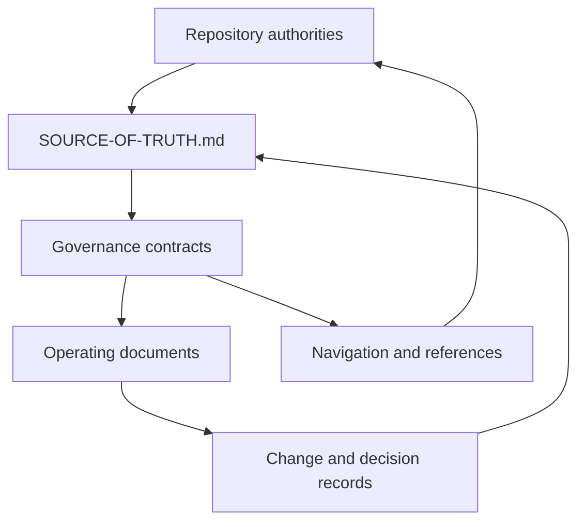
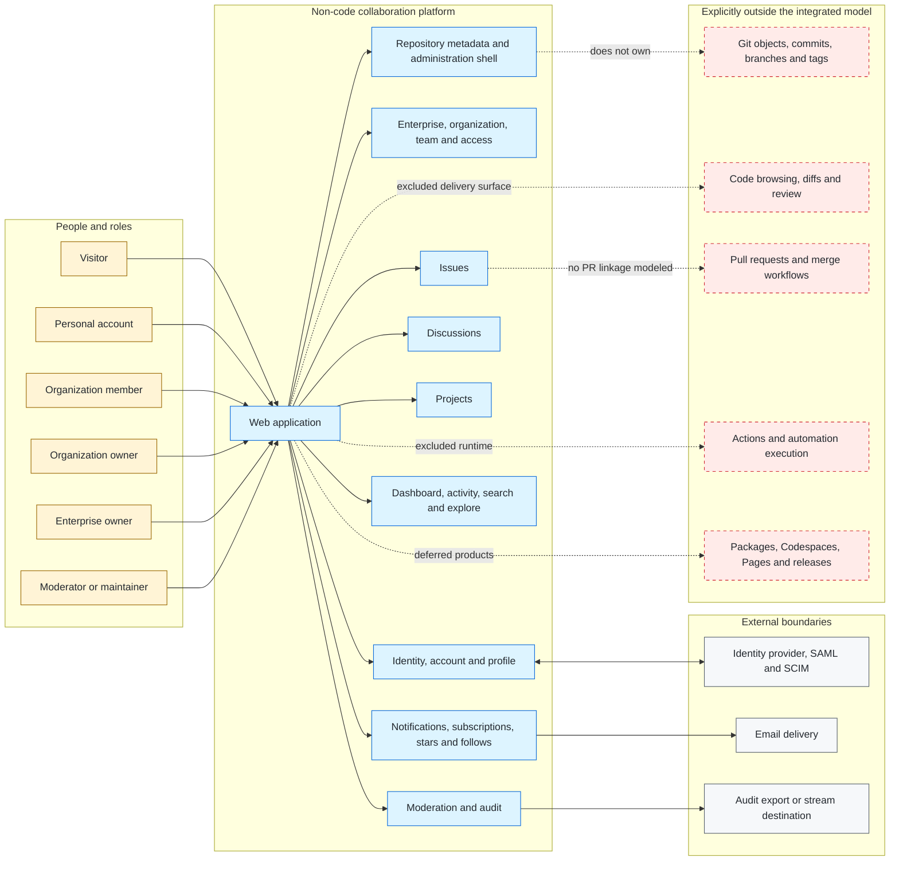
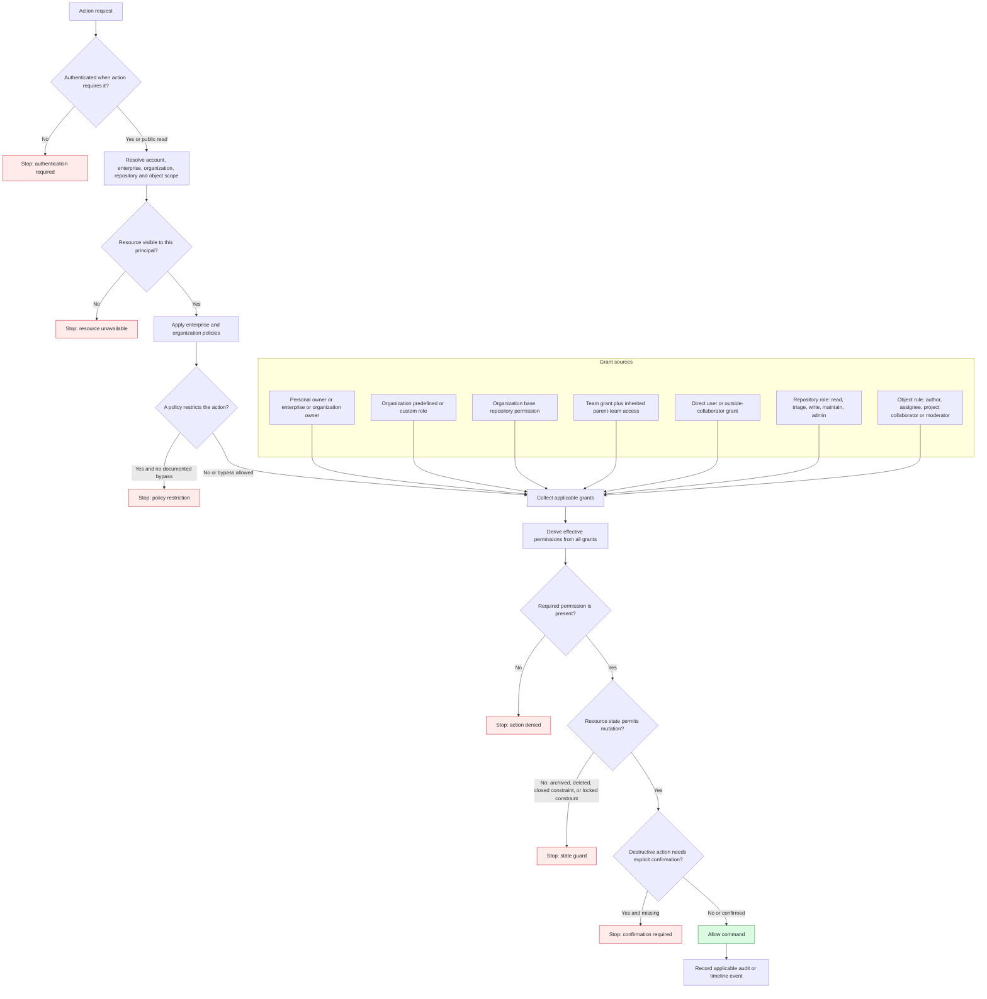
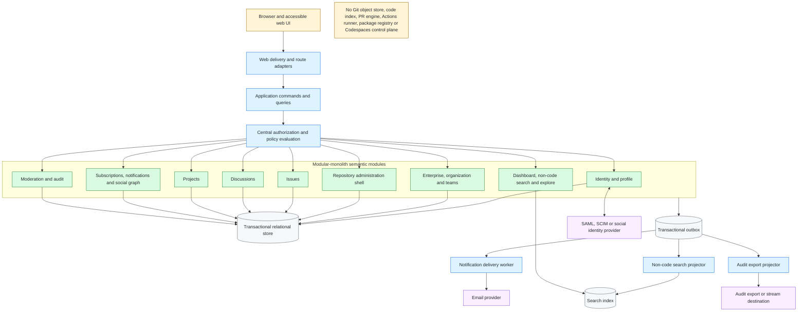
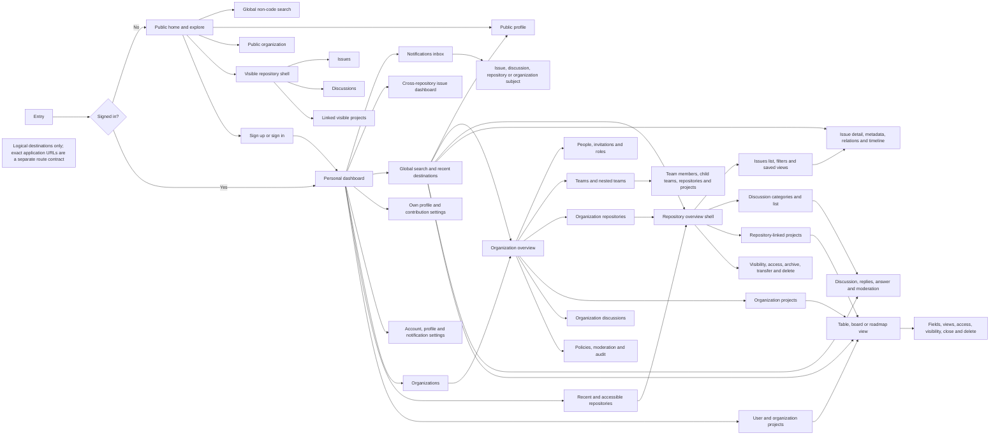

# Documentation Architecture

This document describes the control structure for documentation under `docs/`
and preserves the integrated GitHub non-code product-semantic architecture
views. The product views are evidence-backed reconstruction input: they do not
claim GitHub's internal topology, replace Support's canonical technical
architecture, activate a bounded context, or assign literal routes. Those
concerns remain with the sources listed in
[`SOURCE-OF-TRUTH.md`](SOURCE-OF-TRUTH.md).

## Layers

The documentation system has four layers:

1. **Repository authorities** own product, technical, route, and change
   contracts outside this governance set.
2. **Governance contracts** define documentation authority, classification,
   metadata, naming, relationships, and accepted documentation decisions.
3. **Operating documents** define creation, maintenance, migration, validation,
   history, and planned improvements.
4. **Navigation and reference documents** help readers find and apply the
   contracts without becoming new sources of truth.

Arrows represent a required input or a navigation path. They do not transfer
semantic ownership. The authoritative relationship vocabulary is defined in
[`DEPENDENCIES.md`](DEPENDENCIES.md), and the concrete inventory lives in
[`DOCUMENT-MAP.md`](DOCUMENT-MAP.md).

## Invariants

- Every normative concern has one clearly named owner.
- A supporting document links to an authority instead of restating its rules.
- Current state, accepted decisions, history, and future intent remain separate.
- Generated documents identify their input and are not edited directly.
- A document records its audience, owner, update trigger, relationships, and
  validation path in the document map.
- Existing documentation subtrees keep their current filenames and local
  guidance unless their owning contract is intentionally changed.
- Documentation never claims implementation, verification, source freshness,
  or operational readiness without current evidence.

## Navigation model

[`README.md`](README.md) is the task-oriented entrypoint. [`INDEX.md`](INDEX.md)
is a browsable catalog. Neither owns normative content. Readers use them to
reach the document registered in `DOCUMENT-MAP.md`, then follow that document's
authority and dependency links.

## Change propagation

A change begins at the canonical owner. The maintainer then updates directly
dependent operating documents, navigation entries, examples, and records only
when their content is affected. Broad synchronization is not required merely
because documents link to one another; impact follows the relationship types in
`DEPENDENCIES.md`.

## GitHub non-code system context

This C4-style context view defines product responsibilities, not GitHub's
internal deployment topology.

Evidence: GH-AUTH-002, GH-ENTERPRISE-001, GH-ORG-001, GH-TEAM-001,
GH-REPO-001, GH-ISSUE-001, GH-DISCUSSION-001, GH-PROJECT-001,
GH-NOTIFICATION-001, GH-SEARCH-001, GH-MODERATION-001, and GH-AUDIT-001.

### Derived system-boundary decisions

- A personal account remains distinct from every enterprise, organization,
  team, repository, and project role.
- The repository is retained as a metadata and collaboration owner even though
  its Git objects and code surfaces are excluded.
- Authorization is a cross-cutting decision service; product events remain
  owned by the domain that caused them.
- Search indexes only retained resource types and must enforce the same
  visibility rules as direct navigation.

## Authorization decision model

This is a derived authorization model. GitHub Docs confirms the role, policy,
grant, and object-level facts, but does not publish one universal evaluation
algorithm. The ordering below is the smallest deterministic target model that
preserves confirmed restrictions.

Evidence: GH-ENTERPRISE-001, GH-ENTERPRISE-002, GH-ORG-001, GH-TEAM-001,
GH-REPO-002, GH-REPO-003, GH-REPO-005, GH-REPO-007, GH-ISSUE-002,
GH-COMMUNITY-001, GH-DISCUSSION-001, GH-DISCUSSION-003, GH-PROJECT-002,
GH-MODERATION-002, and GH-AUDIT-001.

### Minimum permission matrix

| Action | Confirmed qualifying actor or grant | Additional guard |
| --- | --- | --- |
| Invite organization member | Organization owner | Invitation limit, license when applicable, target account/email, expiry, required 2FA. |
| Add/remove team member | Organization owner or team maintainer | Principal must be an organization member. |
| Manage repository access | Repository admin; organization owner has administrative access | Enterprise/organization policy can restrict access management. |
| Close own issue | Issue author | Issue and repository must allow the action. |
| Close another user's issue | Personal-repository owner/collaborator or organization-repository triage-plus | Preserve completed/not-planned reason. |
| Manage discussion category | Write-plus for repository or source repository | Discussion feature and valid format/category constraints. |
| Moderate discussion | Triage-plus for repository or organization discussion source repository | Lock, answer, convert, and comment rules differ. |
| Change project visibility | Project admin or applicable organization owner | Item visibility remains constrained by its repository. |
| Archive, transfer, or delete repository | Repository admin or applicable owner | Policy, target eligibility, typed confirmation, and lifecycle guard. |
| Review organization audit log | Organization owner | Retention, query, export, and actor-visibility rules. |

No HTTP status, existence-disclosure rule, or deny precedence beyond documented
policy restrictions is asserted here. Those remain unresolved API-contract
decisions.

## Reconstruction architecture

This is a target architecture inferred for faithful, low-ambiguity
implementation. It is not evidence of GitHub's internal topology. A modular
monolith keeps semantic transactions and authorization decisions inspectable;
asynchronous projections isolate delivery, search, and audit export.

Evidence for product boundaries: GH-AUTH-002, GH-ENTERPRISE-002, GH-ORG-001,
GH-REPO-001, GH-ISSUE-001, GH-DISCUSSION-001, GH-PROJECT-001,
GH-NOTIFICATION-001, GH-SEARCH-001, and GH-AUDIT-001.

### Decisions requiring implementation contracts

- Commands own transactions; search, notification delivery, and external audit
  export consume committed events.
- The transactional outbox is a reconstruction reliability choice, not a
  GitHub-documented fact.
- Authorization must be callable consistently from routes, commands, search,
  notification projection, and navigation visibility.
- The search index contains only retained non-code resources and never becomes
  the authority for access or lifecycle state.
- Audit facts are append-only observations; moderation state and operational
  delivery state remain owned by their product modules.
- External identity and email providers are ports. No provider-specific rule is
  part of the domain unless official product semantics require it.

## Logical product navigation

This diagram defines reachable destinations and navigation responsibilities.
Labels are logical screens, not literal GitHub or Support URLs. The route
contract must assign concrete paths without changing these product semantics.

Evidence: GH-DASH-001, GH-PROFILE-001, GH-ORG-001, GH-TEAM-001,
GH-REPO-003, GH-ISSUE-001, GH-DISCUSSION-001, GH-PROJECT-001,
GH-PROJECT-002, GH-NOTIFICATION-002, and GH-SEARCH-001.

### Navigation invariants

- Public navigation exposes only resources visible to the visitor.
- Authentication returns the user to a valid destination or the personal
  dashboard; it never creates product authorization by itself.
- Menus and direct navigation use the same authorization decision.
- Search results and notification deep links re-evaluate current visibility and
  state.
- Project visibility does not reveal inaccessible private-repository items.
- Administrative destinations appear only for actors with the corresponding
  scoped permission.
