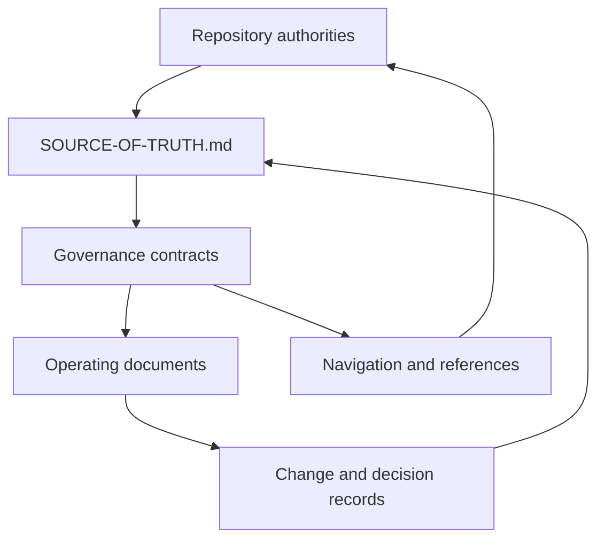

# Documentation Architecture

This document describes the control structure for documentation under `docs/`.
It does not preserve or redefine product semantics, technical architecture,
routes, schemas, or implementation state. Those concerns remain with the
sources listed in [`SOURCE-OF-TRUTH.md`](SOURCE-OF-TRUTH.md); product semantics
specifically remain in [`github-non-code/`](github-non-code/README.md).

## Layers

The documentation system has four layers:

1. **Repository authorities** own product, technical, route, and change
   contracts outside this governance set.
2. **Governance contracts** define documentation authority, classification,
   metadata, naming, relationships, and accepted documentation decisions.
3. **Operating documents** define creation, maintenance, migration, validation,
   history, and planned improvements.
4. **Navigation and reference documents** help readers find and apply the
   contracts without becoming new sources of truth.

Arrows represent a required input or a navigation path. They do not transfer
semantic ownership. The authoritative relationship vocabulary is defined in
[`DEPENDENCIES.md`](DEPENDENCIES.md), and the concrete inventory lives in
[`DOCUMENT-MAP.md`](DOCUMENT-MAP.md).

## Invariants

- Every normative concern has one clearly named owner.
- A supporting document links to an authority instead of restating its rules.
- Current state, accepted decisions, history, and future intent remain separate.
- Generated documents identify their input and are not edited directly.
- A document records its audience, owner, update trigger, relationships, and
  validation path in the document map.
- Existing documentation subtrees keep their current filenames and local
  guidance unless their owning contract is intentionally changed.
- Documentation never claims implementation, verification, source freshness,
  or operational readiness without current evidence.

## Navigation model

[`README.md`](README.md) is the task-oriented entrypoint. [`INDEX.md`](INDEX.md)
is a browsable catalog. Neither owns normative content. Readers use them to
reach the document registered in `DOCUMENT-MAP.md`, then follow that document's
authority and dependency links.

## Change propagation

A change begins at the canonical owner. The maintainer then updates directly
dependent operating documents, navigation entries, examples, and records only
when their content is affected. Broad synchronization is not required merely
because documents link to one another; impact follows the relationship types in
`DEPENDENCIES.md`.
