# Documentation Map

This document is the authoritative inventory of the 21 top-level documentation
governance files, their relationships to existing repository authorities, and
the requirement-to-evidence map for the integrated GitHub non-code semantic
model. [`README.md`](README.md) and [`INDEX.md`](INDEX.md) provide navigation but
do not replace this registry.

## Governance inventory

| Path | Registered title | Class | Authority | Lifecycle | Owner |
| --- | --- | --- | --- | --- | --- |
| [`AGENTS.md`](AGENTS.md) | Documentation Workflow | `governance` | `subordinate` | `active` | Documentation maintainers |
| [`ANTI-PATTERNS.md`](ANTI-PATTERNS.md) | Documentation Anti-Patterns | `reference` | `non-normative` | `active` | Documentation maintainers |
| [`ARCHITECTURE.md`](ARCHITECTURE.md) | Documentation Architecture | `governance` | `canonical` | `active` | Documentation and product-model maintainers |
| [`CHANGELOG.md`](CHANGELOG.md) | Documentation Governance Changelog | `record` | `canonical` | `active` | Documentation maintainers |
| [`CLASSIFICATION.md`](CLASSIFICATION.md) | Documentation Classification | `governance` | `canonical` | `active` | Documentation maintainers |
| [`DECISIONS.md`](DECISIONS.md) | Documentation Governance Decisions | `record` | `canonical` | `active` | Documentation maintainers |
| [`DEPENDENCIES.md`](DEPENDENCIES.md) | Documentation Dependencies | `governance` | `canonical` | `active` | Documentation maintainers |
| [`DOCUMENT-MAP.md`](DOCUMENT-MAP.md) | Documentation Map | `governance` | `canonical` | `active` | Documentation and product-model maintainers |
| [`EXAMPLES.md`](EXAMPLES.md) | Documentation Examples | `reference` | `non-normative` | `active` | Documentation maintainers |
| [`FAQ.md`](FAQ.md) | Documentation FAQ | `reference` | `non-normative` | `active` | Documentation maintainers |
| [`GLOSSARY.md`](GLOSSARY.md) | Documentation Glossary | `reference` | `non-normative` | `active` | Documentation maintainers |
| [`INDEX.md`](INDEX.md) | Documentation Index | `entry` | `navigational` | `active` | Documentation maintainers |
| [`MAINTENANCE.md`](MAINTENANCE.md) | Documentation Maintenance | `workflow` | `canonical` | `active` | Documentation maintainers |
| [`MIGRATION.md`](MIGRATION.md) | Documentation Governance Migration | `workflow` | `canonical` | `active` | Documentation maintainers |
| [`NAMING.md`](NAMING.md) | Documentation Naming | `governance` | `canonical` | `active` | Documentation maintainers |
| [`README.md`](README.md) | Documentation Governance | `entry` | `navigational` | `active` | Documentation maintainers |
| [`ROADMAP.md`](ROADMAP.md) | Documentation Governance Roadmap | `record` | `non-normative` | `active` | Documentation maintainers |
| [`SCHEMA.md`](SCHEMA.md) | Documentation Schema | `governance` | `canonical` | `active` | Documentation and product-model maintainers |
| [`SOURCE-OF-TRUTH.md`](SOURCE-OF-TRUTH.md) | Documentation Sources of Truth | `governance` | `canonical` | `active` | Documentation and product-model maintainers |
| [`VALIDATION.md`](VALIDATION.md) | Documentation Validation | `workflow` | `canonical` | `active` | Documentation maintainers |
| [`WORKFLOWS.md`](WORKFLOWS.md) | Documentation Workflows | `workflow` | `canonical` | `active` | Documentation and product-model maintainers |

## Operating metadata

| Path | Audience | Update trigger | Dependencies | Smallest validation |
| --- | --- | --- | --- | --- |
| [`AGENTS.md`](AGENTS.md) | Agents and documentation reviewers | A `docs/**` instruction, semantic routing rule, or workflow changes | `governed-by`: `../AGENTS.md`; `depends-on`: `SOURCE-OF-TRUTH.md`, `DOCUMENT-MAP.md`, `VALIDATION.md` | Architecture and knowledge guidance checks |
| [`ANTI-PATTERNS.md`](ANTI-PATTERNS.md) | Contributors and reviewers | A recurring documentation failure is verified | `depends-on`: `SOURCE-OF-TRUTH.md`, `WORKFLOWS.md` | H1 and local links |
| [`ARCHITECTURE.md`](ARCHITECTURE.md) | Documentation designers, product architects, and maintainers | A governance layer, product boundary, authorization model, reconstruction choice, or logical destination changes | `depends-on`: `SOURCE-OF-TRUTH.md`, `DOCUMENT-MAP.md`, `SCHEMA.md`, `WORKFLOWS.md`, `DEPENDENCIES.md` | H1, local links, source IDs, and Mermaid consistency |
| [`CHANGELOG.md`](CHANGELOG.md) | Maintainers and reviewers | A governance change is delivered | `governed-by`: `SCHEMA.md`, `NAMING.md` | ISO date and valid change groups |
| [`CLASSIFICATION.md`](CLASSIFICATION.md) | Documentation authors and reviewers | A class, authority, or lifecycle value changes | `depends-on`: `SOURCE-OF-TRUTH.md` | Vocabulary parity with this map |
| [`DECISIONS.md`](DECISIONS.md) | Maintainers and reviewers | A material governance choice is accepted or superseded | `governed-by`: `SCHEMA.md`, `NAMING.md`; `depends-on`: `SOURCE-OF-TRUTH.md` | Unique IDs and complete decision fields |
| [`DEPENDENCIES.md`](DEPENDENCIES.md) | Documentation designers and maintainers | A relationship type or propagation rule changes | `depends-on`: `SOURCE-OF-TRUTH.md`, `CLASSIFICATION.md` | Relationship vocabulary and acyclic normative graph |
| [`DOCUMENT-MAP.md`](DOCUMENT-MAP.md) | Documentation users, product architects, and implementers | A registered document, requirement, evidence mapping, capability status, or acceptance boundary changes | `governed-by`: `SCHEMA.md`, `CLASSIFICATION.md`, `DEPENDENCIES.md`; `depends-on`: `SOURCE-OF-TRUTH.md` | Exact inventory, requirement IDs, source IDs, and metadata completeness |
| [`EXAMPLES.md`](EXAMPLES.md) | Documentation authors | A demonstrated contract changes | `depends-on`: `WORKFLOWS.md`, `SCHEMA.md`, `CLASSIFICATION.md` | Labels, H1, and local links |
| [`FAQ.md`](FAQ.md) | All documentation users | A common answer or authority route changes | `depends-on`: `README.md`, `SOURCE-OF-TRUTH.md` | Answers agree with canonical owners |
| [`GLOSSARY.md`](GLOSSARY.md) | All documentation users | A governance term is added or changes | `depends-on`: `CLASSIFICATION.md`, `DEPENDENCIES.md` | Terms agree with owning contracts |
| [`INDEX.md`](INDEX.md) | Readers locating documentation | A registered file or documentation area changes | `depends-on`: `DOCUMENT-MAP.md` | Exact 21-file navigation coverage |
| [`MAINTENANCE.md`](MAINTENANCE.md) | Maintainers | An owner, review trigger, or health signal changes | `depends-on`: `DOCUMENT-MAP.md`, `VALIDATION.md` | Triggers have owners and verifiable outcomes |
| [`MIGRATION.md`](MIGRATION.md) | Maintainers adopting the model | An adoption or deprecation rule changes | `depends-on`: `WORKFLOWS.md`, `DOCUMENT-MAP.md` | No runtime-migration claims and valid links |
| [`NAMING.md`](NAMING.md) | Authors and reviewers | A filename, title, identifier, or link rule changes | `depends-on`: `SOURCE-OF-TRUTH.md` | Path, title, ID, and link consistency |
| [`README.md`](README.md) | Documentation users, product architects, and implementers | A primary task route, semantic scope, method, or model owner changes | `depends-on`: `INDEX.md`, `DOCUMENT-MAP.md`, `SOURCE-OF-TRUTH.md`, `ARCHITECTURE.md`, `SCHEMA.md`, `WORKFLOWS.md`, `VALIDATION.md` | Entry links, scope, and model routing resolve |
| [`ROADMAP.md`](ROADMAP.md) | Maintainers planning improvements | A candidate is added, promoted, completed, or rejected | `governed-by`: `SCHEMA.md`; `references`: `DECISIONS.md`, `CHANGELOG.md` | Intent is not presented as delivery |
| [`SCHEMA.md`](SCHEMA.md) | Governance authors, domain modelers, and tooling designers | A logical record field, product concept, relationship, or cardinality changes | `depends-on`: `CLASSIFICATION.md`, `NAMING.md`, `SOURCE-OF-TRUTH.md`, `DOCUMENT-MAP.md` | Required fields, source IDs, ERD rendering, and modeling invariants |
| [`SOURCE-OF-TRUTH.md`](SOURCE-OF-TRUTH.md) | Documentation users, product architects, and reviewers | A canonical concern, official product source, supported semantic claim, or verification date changes | `references`: repository authority endpoints and registered GitHub sources | Authority and source rows resolve, remain unique, and do not overlap |
| [`VALIDATION.md`](VALIDATION.md) | Authors and reviewers | A relevant command, semantic integrity check, or reporting rule changes | `governed-by`: `../CONTRIBUTING.md`; `depends-on`: `DOCUMENT-MAP.md`, `SOURCE-OF-TRUTH.md` | Documented checks exist and cover source, requirement, diagram, and link integrity |
| [`WORKFLOWS.md`](WORKFLOWS.md) | Documentation authors, domain modelers, and maintainers | A documentation lifecycle, product state, transition, interaction sequence, or failure requirement changes | `depends-on`: `SOURCE-OF-TRUTH.md`, `DOCUMENT-MAP.md`, `SCHEMA.md`, `CLASSIFICATION.md`, `VALIDATION.md` | Documentation and product lifecycle transitions, sequences, and failures are covered |

## Repository authority endpoints

These existing artifacts are dependencies of this governance layer, not members
of the 21-file inventory.

| Endpoint | Registered concern | Relationship |
| --- | --- | --- |
| [`../AGENTS.md`](../AGENTS.md) | Repository-wide engineering guidance | `AGENTS.md` is `governed-by` it. |
| [`../CONTRIBUTING.md`](../CONTRIBUTING.md) | Change and review lifecycle | Documentation workflows and validation reference it. |
| [`architecture/architecture.md`](architecture/architecture.md) | Human-readable technical architecture | Governance documents reference it; they do not summarize it as a new contract. |
| [`../packages/tooling/src/architecture/policy.mjs`](../packages/tooling/src/architecture/policy.mjs) | Machine-enforced `ARCH-*` policy | Architecture documentation declares it as enforcement owner. |
| [`architecture/module-map.json`](architecture/module-map.json) | Bounded-context catalog | `module-map.md` is `generated-from` it. |
| [`../apps/web/route-map.json`](../apps/web/route-map.json) | Application route contract | Generated route documentation is projected from it. |
| [`github-non-code/README.md`](github-non-code/README.md) | GitHub non-code product evidence and logical semantics | Top-level governance files link to it and must not become a competing model. |
| [`architecture/data-model/README.md`](architecture/data-model/README.md) | Database-design handoff | Resolves active physical disposition before declarative SQL exists. |
| [`../supabase/schemas/`](../supabase/schemas/) | Desired physical database state | Ordered declarative SQL is the sole physical target authority. |

## Registration rules

- Keep one row per top-level governance document in both inventory tables.
- Keep titles identical to their H1 text and paths repository-relative.
- Use only vocabulary defined by [`CLASSIFICATION.md`](CLASSIFICATION.md) and
  [`DEPENDENCIES.md`](DEPENDENCIES.md).
- Update identity, ownership, lifecycle, and relationship changes atomically
  with the affected document, index, decision, and changelog entries.
- Do not expand this map into a catalog of every generated route or bounded-
  context README; their existing source contracts already own those inventories.

## Product requirements traceability

Authority: the official GitHub product source register in
[`github-non-code/source-register.md`](github-non-code/source-register.md).
Every requirement must map to
official evidence, a model owner, and future acceptance tests before
implementation.

```mermaid
requirementDiagram
    requirement Boundary {
        id: "SCOPE-001"
        text: "Preserve GitHub collaboration semantics while excluding Git and code workflows"
        risk: high
        verifymethod: inspection
    }
    functionalRequirement Accounts {
        id: "ACT-001"
        text: "Personal account authentication profile and dashboard"
        risk: medium
        verifymethod: analysis
    }
    functionalRequirement Governance {
        id: "GOV-001"
        text: "Enterprise organization team role and policy governance"
        risk: high
        verifymethod: analysis
    }
    functionalRequirement Collaboration {
        id: "COL-001"
        text: "Repository shell issues discussions and projects"
        risk: high
        verifymethod: test
    }
    functionalRequirement Engagement {
        id: "ENG-001"
        text: "Notifications subscriptions stars follows activity and search"
        risk: medium
        verifymethod: test
    }
    functionalRequirement Safety {
        id: "SAFE-001"
        text: "Moderation blocking reporting interaction limits and audit"
        risk: high
        verifymethod: test
    }
    element AccountProfile {
        type: "bounded-context"
        docref: "docs/SOURCE-OF-TRUTH.md"
    }
    element GovernanceModel {
        type: "bounded-context"
        docref: "docs/SOURCE-OF-TRUTH.md"
    }
    element CollaborationModel {
        type: "bounded-context"
        docref: "docs/SOURCE-OF-TRUTH.md"
    }
    element EngagementModel {
        type: "bounded-context"
        docref: "docs/SOURCE-OF-TRUTH.md"
    }
    element TrustModel {
        type: "bounded-context"
        docref: "docs/SOURCE-OF-TRUTH.md"
    }

    Boundary - contains -> Accounts
    Boundary - contains -> Governance
    Boundary - contains -> Collaboration
    Boundary - contains -> Engagement
    Boundary - contains -> Safety
    AccountProfile - satisfies -> Accounts
    GovernanceModel - satisfies -> Governance
    CollaborationModel - satisfies -> Collaboration
    EngagementModel - satisfies -> Engagement
    TrustModel - satisfies -> Safety
```

| Requirement | Confirmed obligation | Evidence | Future acceptance focus |
| --- | --- | --- | --- |
| SCOPE-001 | Retain only non-code collaboration semantics named by this model. | Task boundary; all registered sources | Excluded capabilities have no routes, commands, storage, or navigation. |
| ACT-001 | A personal account is the user identity; authentication, profile privacy, and dashboard visibility are distinct concerns. | GH-AUTH-001, GH-AUTH-002, GH-ACCOUNT-001, GH-PROFILE-001, GH-DASH-001 | Signup/verification, sign-in boundaries, private-profile visibility, deletion prerequisites. |
| GOV-001 | Permissions come from scoped roles, memberships, teams, direct grants, and additive policy constraints. | GH-ENTERPRISE-001, GH-ENTERPRISE-002, GH-ORG-001, GH-ORG-002, GH-TEAM-001, GH-REPO-002 | Role combinations, nested teams, invitation eligibility, policy restriction and bypass. |
| COL-001 | A repository is the discoverable collaboration owner shell for Issues and Discussions, while Projects may be user- or organization-owned. | GH-REPO-001 through GH-REPO-011, GH-ISSUE-001, GH-ISSUE-002, GH-DISCUSSION-001 through GH-DISCUSSION-003, GH-PROJECT-001 through GH-PROJECT-004 | Searchable visible-repository lists; owner-authorized creation; shared repository navigation; denial-safe not-found; archived read-only views; deleted-repository restoration under personal or organization settings; ownership, visibility, lifecycle, metadata reconciliation, and forbidden transitions. |
| ENG-001 | Watching/participation creates subscriptions; notifications expose reason plus independent read and triage choices; stars/follows influence discovery. | GH-NOTIFICATION-001, GH-NOTIFICATION-002, GH-STAR-001, GH-FOLLOW-001, GH-SEARCH-001 | Subscription sources, delivery choice, inbox triage, visibility-safe discovery and search. |
| SAFE-001 | Moderation and audit have separate actors, resources, actions, visibility, and retention rules. | GH-COMMUNITY-001, GH-MODERATION-001, GH-MODERATION-002, GH-AUDIT-001 | Lock/hide/report/block permissions, actor visibility, audit facts and export. |

## Repository capability matrix

`Evidence` records what GitHub Docs directly confirms. `Support status` records
the repository boundary observed on 2026-07-30 and does not promote a deferred
capability to an active architecture contract. Current status must still be
checked against [`architecture/module-map.json`](architecture/module-map.json)
and implementation evidence before use.

| Capability | Evidence | Recorded Support status | Trace and acceptance boundary |
| --- | --- | --- | --- |
| Repository dashboard, search, filters, sorting, and creation entrypoint | Confirmed | Active | GH-REPO-009, GH-REPO-010; authenticated dashboards return repositories visible to the actor, public owner/repository reads accept an anonymous principal, and empty-owner and no-match states remain distinct. |
| Personal or organization ownership, visibility, effective roles, and access sources | Confirmed | Active | GH-REPO-001 through GH-REPO-004; public resources may be read anonymously, private/internal discovery is permission-filtered, and denied lookup is indistinguishable from absence. |
| Rename, archive/unarchive, delete, and restore | Confirmed | Active | GH-REPO-005, GH-REPO-007, GH-REPO-008, GH-REPO-011; archived repositories remain readable but only Star remains mutable, deleted repositories leave normal navigation, and restore is owner-only within 90 days without restoring team grants. |
| Issues, Discussions, Projects, Activity, Stars, and Watchers in the repository shell | Confirmed | Active | GH-REPO-001, GH-REPO-005, GH-ISSUE-001, GH-DISCUSSION-001, GH-PROJECT-001, GH-NOTIFICATION-001, GH-STAR-001; tabs preserve repository context and direct navigation repeats authorization. |
| Repository transfer | Confirmed | Deferred | GH-REPO-006; record retained metadata and assignment reconciliation without activating routes, commands, or persistence. |
| Direct collaborator invitations and outside-collaborator workflows | Confirmed | Deferred | GH-REPO-003; the active Access view exposes existing direct/inherited team sources but does not activate invitation workflows. |
| Repository feature metadata, templates, forks, and releases | Unresolved or out of slice | Deferred | Preserve as a mapping gap; do not infer fields, navigation, or lifecycle behavior from GitHub resemblance. |
| Git content, commits, branches, pull requests, review, and Actions | Confirmed GitHub capabilities | Excluded | SCOPE-001; no routes, commands, storage, or repository tabs may activate these capabilities. |

### Current interaction observation recorded on 2026-07-30

- **Confirmed:** GitHub documentation places repository discovery and creation
  at the repository dashboard, and repository-scoped collaboration under a
  shared repository identity and navigation shell.
- **Derived for Support:** the sidebar names resource collections only; `New`
  remains an index/header action. Public owner and repository views keep the
  same shell, while write controls require an authenticated principal and
  archived repositories explain their read-only state.
- **Deferred:** pixel-level parity, Git/Code surfaces, direct collaborators,
  transfer, forks, releases, and planned enterprise products are not inferred
  from the recorded GitHub website observation.
