# Documentation Schema

This schema defines logical records for the documentation governance system.
It is represented in Markdown tables and sections; version 1 does not require
YAML front matter or change any application, API, event, or database schema.

## Document record

[`DOCUMENT-MAP.md`](DOCUMENT-MAP.md) contains one record for every top-level
governance document.

| Field | Cardinality | Contract |
| --- | --- | --- |
| `path` | Required, unique | Repository-relative Markdown path. |
| `title` | Required | Exact H1 text. |
| `class` | Required | One class from [`CLASSIFICATION.md`](CLASSIFICATION.md). |
| `authority` | Required | One authority value from `CLASSIFICATION.md`. |
| `lifecycle` | Required | One lifecycle value from `CLASSIFICATION.md`. |
| `owner` | Required | Role or repository boundary responsible for correctness. |
| `audience` | Required | Primary reader group. |
| `update trigger` | Required | Observable event that requires review. |
| `dependencies` | Zero or more | Typed relationships defined by [`DEPENDENCIES.md`](DEPENDENCIES.md). |
| `validation` | Required | Smallest check that demonstrates structural integrity. |

Paths and titles identify a document; they do not grant authority. Authority is
assigned by its registered concern in
[`SOURCE-OF-TRUTH.md`](SOURCE-OF-TRUTH.md).

## Decision record

Each entry in [`DECISIONS.md`](DECISIONS.md) contains:

| Field | Required | Contract |
| --- | --- | --- |
| `id` | Yes | Stable `DOC-DEC-NNN` identifier. |
| `status` | Yes | `Proposed`, `Accepted`, or `Superseded`. |
| `date` | Yes | ISO `YYYY-MM-DD` decision date. |
| `decision` | Yes | The selected documentation-governance rule. |
| `rationale` | Yes | Evidence or constraint that made the choice appropriate. |
| `consequences` | Yes | Operational and maintenance effects. |
| `supersedes` | When applicable | Identifier of the replaced decision. |

Decision records are append-preserving. Correct typographical errors in place,
but supersede a changed decision rather than rewriting its historical meaning.

## Changelog entry

Each dated section in [`CHANGELOG.md`](CHANGELOG.md) uses an ISO date and only
the applicable `Added`, `Changed`, `Deprecated`, or `Removed` groups. Entries
describe documentation-governance changes, not product releases or source-code
behavior.

## Roadmap entry

[`ROADMAP.md`](ROADMAP.md) groups items under `Now`, `Next`, or `Later`. An item
states the intended outcome, prerequisite, and evidence needed to promote it.
Roadmap placement is not an accepted decision, deadline, or implementation
claim.

## Conformance

A record conforms when all required fields are present, values use the canonical
vocabulary, local paths resolve, and no two records assign the same concern to
different canonical owners. Validation is defined in
[`VALIDATION.md`](VALIDATION.md).

## Conceptual product model

The following ERD preserves the GitHub non-code conceptual domain model. It is
not a physical database schema. IDs, principal references, polymorphic owners,
and generic metadata/value fields must be refined into explicit implementation
contracts before migration work.

Evidence: GH-ACCOUNT-001, GH-ENTERPRISE-001, GH-ORG-001 through GH-ORG-003,
GH-TEAM-001, GH-REPO-001 through GH-REPO-008, GH-ISSUE-001,
GH-DISCUSSION-001 through GH-DISCUSSION-003, GH-PROJECT-001,
GH-NOTIFICATION-001, GH-NOTIFICATION-002, GH-STAR-001, GH-FOLLOW-001,
GH-MODERATION-001, and GH-AUDIT-001. Evidence records are owned by
[`SOURCE-OF-TRUTH.md`](SOURCE-OF-TRUTH.md).

```mermaid
erDiagram
    PERSONAL_ACCOUNT {
        string account_id PK
        string username UK
        string account_kind
        string lifecycle_state
    }
    PROFILE {
        string account_id PK,FK
        string visibility
        string bio
    }
    FOLLOW {
        string follower_id PK,FK
        string followed_id PK,FK
    }
    ENTERPRISE {
        string enterprise_id PK
        string name UK
    }
    ENTERPRISE_MEMBERSHIP {
        string enterprise_id PK,FK
        string account_id PK,FK
        string role
        string state
    }
    ORGANIZATION {
        string organization_id PK
        string enterprise_id FK
        string login UK
    }
    ORGANIZATION_MEMBERSHIP {
        string organization_id PK,FK
        string account_id PK,FK
        string base_role
        string state
    }
    ORGANIZATION_INVITATION {
        string invitation_id PK
        string organization_id FK
        string target
        string proposed_role
        string state
        datetime expires_at
    }
    ORGANIZATION_ROLE_ASSIGNMENT {
        string assignment_id PK
        string organization_id FK
        string principal_id FK
        string role
    }
    TEAM {
        string team_id PK
        string organization_id FK
        string parent_team_id FK
        string visibility
    }
    TEAM_MEMBERSHIP {
        string team_id PK,FK
        string account_id PK,FK
        string team_role
    }
    REPOSITORY {
        string repository_id PK
        string owner_id FK
        string name
        string visibility
        string lifecycle_state
    }
    REPOSITORY_ACCESS_GRANT {
        string grant_id PK
        string repository_id FK
        string principal_id FK
        string repository_role
        string source
    }
    REPOSITORY_POLICY {
        string policy_id PK
        string owner_scope_id FK
        string enforcement_state
        string restriction_kind
    }
    ISSUE {
        string issue_id PK
        string repository_id FK
        int number UK
        string state
        string state_reason
    }
    ISSUE_COMMENT {
        string comment_id PK
        string issue_id FK
        string author_id FK
        string moderation_state
    }
    ISSUE_RELATION {
        string relation_id PK
        string source_issue_id FK
        string target_issue_id FK
        string relation_kind
    }
    ISSUE_ASSIGNEE {
        string issue_id PK,FK
        string account_id PK,FK
    }
    ISSUE_METADATA {
        string metadata_id PK
        string issue_id FK
        string kind
        string value
    }
    DISCUSSION_CATEGORY {
        string category_id PK
        string host_id FK
        string format
        string name
    }
    DISCUSSION {
        string discussion_id PK
        string category_id FK
        string author_id FK
        string state
        string close_reason
    }
    DISCUSSION_COMMENT {
        string comment_id PK
        string discussion_id FK
        string author_id FK
        boolean is_answer
        string moderation_state
    }
    PROJECT {
        string project_id PK
        string owner_id FK
        string visibility
        string lifecycle_state
    }
    PROJECT_ITEM {
        string project_item_id PK
        string project_id FK
        string content_kind
        string content_id
        string item_state
    }
    PROJECT_FIELD {
        string field_id PK
        string project_id FK
        string field_type
        string name
    }
    PROJECT_FIELD_VALUE {
        string project_item_id PK,FK
        string field_id PK,FK
        string value
    }
    SUBSCRIPTION {
        string subscription_id PK
        string account_id FK
        string target_id FK
        string reason
        string state
    }
    NOTIFICATION {
        string notification_id PK
        string account_id FK
        string subject_id FK
        string reason
        string read_state
        string triage_state
    }
    STAR {
        string account_id PK,FK
        string repository_id PK,FK
    }
    MODERATION_ACTION {
        string action_id PK
        string actor_id FK
        string target_id FK
        string action_kind
    }
    AUDIT_EVENT {
        string event_id PK
        string actor_id FK
        string scope_id FK
        string action
        datetime occurred_at
    }

    PERSONAL_ACCOUNT ||--|| PROFILE : presents
    PERSONAL_ACCOUNT ||--o{ FOLLOW : follows
    ENTERPRISE ||--o{ ORGANIZATION : governs
    ENTERPRISE ||--o{ ENTERPRISE_MEMBERSHIP : includes
    PERSONAL_ACCOUNT ||--o{ ENTERPRISE_MEMBERSHIP : holds
    ORGANIZATION ||--o{ ORGANIZATION_MEMBERSHIP : includes
    PERSONAL_ACCOUNT ||--o{ ORGANIZATION_MEMBERSHIP : holds
    ORGANIZATION ||--o{ ORGANIZATION_INVITATION : issues
    ORGANIZATION ||--o{ ORGANIZATION_ROLE_ASSIGNMENT : defines
    ORGANIZATION ||--o{ TEAM : owns
    TEAM o|--o{ TEAM : parent_of
    TEAM ||--o{ TEAM_MEMBERSHIP : includes
    PERSONAL_ACCOUNT ||--o{ TEAM_MEMBERSHIP : joins
    ORGANIZATION ||--o{ REPOSITORY : owns
    REPOSITORY ||--o{ REPOSITORY_ACCESS_GRANT : grants
    REPOSITORY ||--o{ REPOSITORY_POLICY : constrained_by
    REPOSITORY ||--o{ ISSUE : contains
    ISSUE ||--o{ ISSUE_COMMENT : has
    ISSUE ||--o{ ISSUE_RELATION : relates
    ISSUE ||--o{ ISSUE_ASSIGNEE : assigned
    ISSUE ||--o{ ISSUE_METADATA : describes
    REPOSITORY ||--o{ DISCUSSION_CATEGORY : hosts
    DISCUSSION_CATEGORY ||--o{ DISCUSSION : classifies
    DISCUSSION ||--o{ DISCUSSION_COMMENT : has
    PERSONAL_ACCOUNT ||--o{ PROJECT : owns
    ORGANIZATION ||--o{ PROJECT : owns
    PROJECT ||--o{ PROJECT_ITEM : contains
    ISSUE o|--o{ PROJECT_ITEM : referenced_by
    PROJECT ||--o{ PROJECT_FIELD : defines
    PROJECT_ITEM ||--o{ PROJECT_FIELD_VALUE : has
    PROJECT_FIELD ||--o{ PROJECT_FIELD_VALUE : receives
    PERSONAL_ACCOUNT ||--o{ SUBSCRIPTION : configures
    PERSONAL_ACCOUNT ||--o{ NOTIFICATION : receives
    PERSONAL_ACCOUNT ||--o{ STAR : creates
    REPOSITORY ||--o{ STAR : receives
    PERSONAL_ACCOUNT ||--o{ MODERATION_ACTION : performs
    PERSONAL_ACCOUNT ||--o{ AUDIT_EVENT : acts_in
```

### Product modeling invariants

- Roles belong to scoped relationships or assignments, never directly to the
  personal account.
- A team contains organization members only. A child team has at most one
  parent and inherits repository access from parent teams.
- A repository has exactly one owner account. An organization-owned repository
  can combine base permission, direct grants, team grants, and organization
  roles under enterprise/organization policy.
- An organization discussion is exposed at organization scope but governed by
  the selected source repository. `DISCUSSION_CATEGORY.host_id` is conceptual
  until that dual scope receives a concrete schema.
- A Project has exactly one owner, either a personal account or an
  organization. This XOR constraint is not expressible in the diagram.
- Notification read status and triage status are independent projections.
- `principal_id`, `owner_id`, `target_id`, `subject_id`, and generic values are
  placeholders that must not become unvalidated polymorphic foreign keys.
