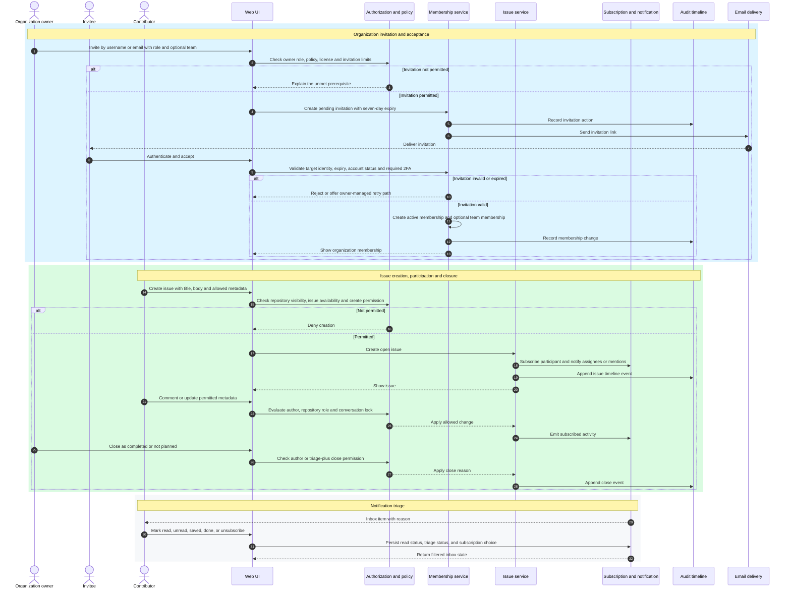

# Documentation Workflows

These workflows apply the documentation contracts without changing the product,
technical architecture, or repository change process. Repository-wide change
and review requirements remain in [`../CONTRIBUTING.md`](../CONTRIBUTING.md).

## Create a document

1. State the audience, concrete question, owner, and expected update trigger.
2. Search [`SOURCE-OF-TRUTH.md`](SOURCE-OF-TRUTH.md) and the existing tree for an
   authority that already owns the concern. Extend or link to it instead of
   creating a competing document.
3. Select one class, authority value, and lifecycle from
   [`CLASSIFICATION.md`](CLASSIFICATION.md).
4. Choose a compliant path, title, and identifier using
   [`NAMING.md`](NAMING.md).
5. Write the smallest document that answers the stated question. Mark examples,
   future intent, and unverified claims explicitly.
6. Register the document and its typed relationships in
   [`DOCUMENT-MAP.md`](DOCUMENT-MAP.md) when it belongs to the top-level
   governance set. Add navigational links only where readers need them.
7. Run [`VALIDATION.md`](VALIDATION.md) and record the delivered governance
   change in [`CHANGELOG.md`](CHANGELOG.md).

## Change a document

1. Inspect the worktree and confirm the target document, its owner, and unrelated
   user changes.
2. Verify the current authority or evidence before changing a normative claim.
3. Edit the canonical owner first. Do not repair a conflict by changing only a
   generated, subordinate, or non-normative document.
4. Follow incoming `governed-by` and `depends-on` relationships from the document
   map and update only affected dependents.
5. Add a decision record when authority, classification, schema, naming,
   dependency, or lifecycle policy changes.
6. Add a changelog entry, inspect the actual diff, and run the smallest relevant
   validation.

## Replace or deprecate a document

1. Name the active replacement and explain why the old responsibility is moving.
2. Change the old document's lifecycle to `deprecated` in the document map.
3. Add a prominent replacement link without rewriting the historical meaning.
4. Move active navigation to the replacement and update required dependencies.
5. Keep the deprecated path until valid consumers have migrated or a deliberate
   removal decision is accepted.

## Archive or remove a document

Archive only when the document is no longer active but must remain as historical
evidence. Remove it from active navigation, retain its context, and register the
`archived` lifecycle. Delete only when retention is unnecessary, links and
dependencies are clear, and the change is recorded.

## Change a generated document

Identify its `generated-from` relationship, change the declared input, run the
owner generator, and inspect the generated diff. Never edit the projection
directly. The commands and ownership boundaries for architecture projections
remain in [`architecture/AGENTS.md`](architecture/AGENTS.md).

## Handoff

A documentation change is ready for review when its authority is clear, map and
navigation entries agree, local links resolve, examples are labeled, the diff is
scoped, and validation results distinguish passed, failed, and unexecuted checks.

## Product lifecycle model

The grouped state model intentionally keeps independent dimensions separate.
For example, issue open/closed status does not determine whether its
conversation is locked, and notification read state does not determine whether
the item is saved or done.

Evidence: GH-AUTH-001, GH-ACCOUNT-001, GH-ORG-002, GH-ORG-003, GH-REPO-005,
GH-REPO-007, GH-REPO-008, GH-ISSUE-002, GH-COMMUNITY-001,
GH-DISCUSSION-002, GH-DISCUSSION-003, GH-PROJECT-003,
GH-NOTIFICATION-001, and GH-NOTIFICATION-002. Evidence records are owned by
[`SOURCE-OF-TRUTH.md`](SOURCE-OF-TRUTH.md).

```mermaid
stateDiagram-v2
    state "Personal account" as Account {
        [*] --> CreatedUnverified
        CreatedUnverified --> Active: email verified
        Active --> Suspended: account-type-dependent suspension
        Suspended --> Active: reinstated
        Active --> Deleted: owner deletes account
        Deleted --> [*]
    }

    state "Organization invitation" as Invitation {
        [*] --> Pending
        Pending --> Accepted: invitee accepts
        Pending --> Cancelled: owner cancels
        Pending --> Expired: seven days elapse
        Expired --> Pending: owner retries
        Accepted --> [*]
        Cancelled --> [*]
    }

    state "Organization membership" as Membership {
        [*] --> ActiveMember
        ActiveMember --> FormerMember: removed or leaves
        FormerMember --> ActiveMember: owner reinstates
    }

    state "Repository shell" as Repository {
        [*] --> ActiveRepository
        ActiveRepository --> ArchivedRepository: admin archives
        ArchivedRepository --> ActiveRepository: admin unarchives
        ActiveRepository --> DeletedRepository: authorized deletion
        DeletedRepository --> ActiveRepository: eligible restore within ninety days
        DeletedRepository --> PermanentlyRemoved: ineligible or restoration window ends
        PermanentlyRemoved --> [*]
    }

    state "Issue status" as IssueStatus {
        [*] --> OpenIssue
        OpenIssue --> ClosedCompleted: close as completed
        OpenIssue --> ClosedNotPlanned: close as not planned
        ClosedCompleted --> OpenIssue: reopen
        ClosedNotPlanned --> OpenIssue: reopen
    }

    state "Issue conversation" as IssueConversation {
        [*] --> IssueUnlocked
        IssueUnlocked --> IssueLocked: authorized lock
        IssueLocked --> IssueUnlocked: authorized unlock
    }

    state "Discussion status" as DiscussionStatus {
        [*] --> OpenDiscussion
        OpenDiscussion --> ClosedDiscussion: resolved irrelevant or duplicate
        OpenDiscussion --> DeletedDiscussion: maintainer deletes
        ClosedDiscussion --> DeletedDiscussion: maintainer deletes
        DeletedDiscussion --> [*]
    }

    state "Q and A answer" as AnswerState {
        [*] --> Unanswered
        Unanswered --> Answered: mark comment as answer
        Answered --> Unanswered: unmark answer
    }

    state "Discussion conversation" as DiscussionConversation {
        [*] --> DiscussionUnlocked
        DiscussionUnlocked --> DiscussionLocked: moderator locks
        DiscussionLocked --> DiscussionUnlocked: moderator unlocks
    }

    state "Project" as Project {
        [*] --> OpenProject
        OpenProject --> ClosedProject: close
        ClosedProject --> OpenProject: reopen
        OpenProject --> DeletedProject: permanently delete
        ClosedProject --> DeletedProject: permanently delete
        DeletedProject --> [*]
    }

    state "Notification read status" as NotificationRead {
        [*] --> Unread
        Unread --> Read: mark read
        Read --> Unread: mark unread
    }

    state "Notification triage" as NotificationTriage {
        [*] --> Inbox
        Inbox --> Saved: save
        Saved --> Inbox: unsave
        Inbox --> Done: mark done
        Saved --> Done: mark done
    }

    state "Subscription" as Subscription {
        [*] --> Subscribed
        Subscribed --> Unsubscribed: unsubscribe or unwatch
        Unsubscribed --> Subscribed: subscribe or watch
    }
```

### Product transition constraints

- `Suspended` is account-type and administrator dependent; it is not a normal
  self-service personal-account state.
- Repository restoration is eligibility constrained and does not restore team
  permissions.
- Archived repositories are read-only; retained content and permissions cannot
  be mutated until unarchived.
- Issue close reason and discussion answer are domain facts, not cosmetic UI
  labels.
- `Saved` is not a read state. Implementations must not collapse `read_state`
  and `triage_state` into one enum.
- Destructive terminal states require separate retention and audit decisions.

## Core product interaction sequences

These sequences are target reconstruction flows, not claims about GitHub's
private services. They preserve observable actors, prerequisites, results, and
side effects from the official documentation.

Evidence: GH-ORG-002, GH-ORG-003, GH-ISSUE-001, GH-ISSUE-002,
GH-COMMUNITY-001, GH-NOTIFICATION-001, GH-NOTIFICATION-002, and GH-AUDIT-001.

### Required product failure coverage

- duplicate, expired, canceled, flagged-account, unverified-email, required-2FA,
  plan-license, and rate-limit invitation cases;
- policy-denied, role-denied, archived-repository, and locked-conversation issue
  mutations;
- notification participation, mention, watch, custom watch, ignore,
  unsubscribe, done, saved, and retention cases; and
- audit/timeline side effects only after the associated command outcome is
  known.
