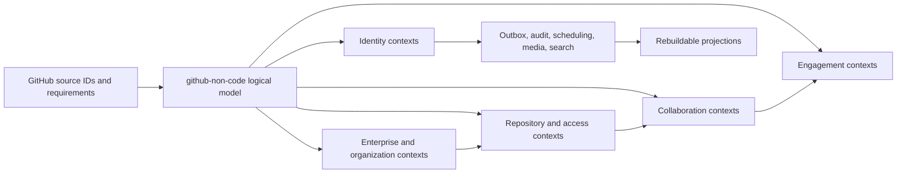
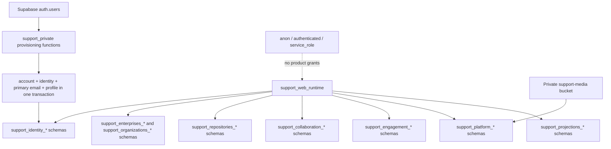
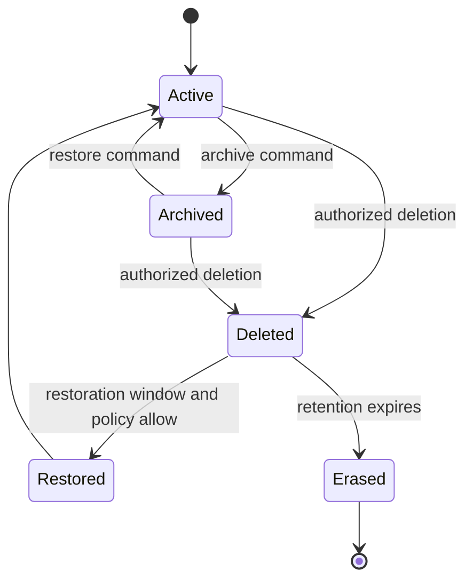
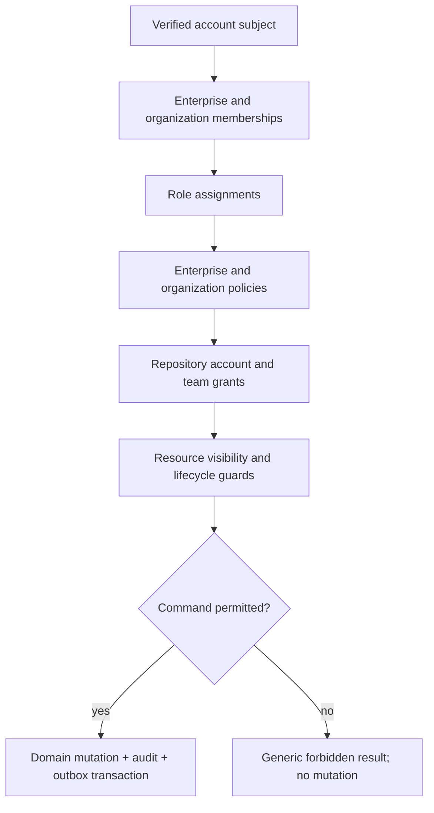
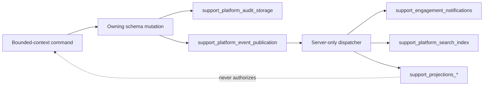
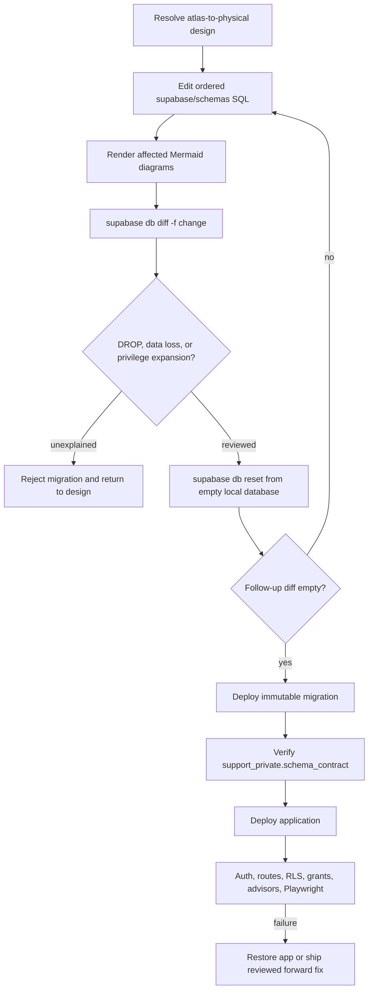

# Database Design Diagrams

Every node below maps to `active-model.md`, `planned-model.md`, or an exact SQL
object. Diagrams summarize those contracts and do not add semantics.

## Logical bounded-context model

## Active physical ownership

## Lifecycle encoding

Independent state dimensions such as visibility, membership, invitation,
conversation lock, issue/discussion closure, delivery, and publication use
their own named text `CHECK` constraints; they are not collapsed into this
illustrative lifecycle.

## Authorization decision flow

## Cross-context effects

## Generation and release

