# Requirements Traceability

Authority: [`source-register.md`](source-register.md). Verification: each
requirement must map to official evidence, a model owner, and future acceptance
tests before implementation.

```mermaid
requirementDiagram
    requirement Boundary {
        id: "SCOPE-001"
        text: "Preserve GitHub collaboration semantics while excluding Git and code workflows"
        risk: high
        verifymethod: inspection
    }
    functionalRequirement Accounts {
        id: "ACT-001"
        text: "Personal account authentication profile and dashboard"
        risk: medium
        verifymethod: analysis
    }
    functionalRequirement Governance {
        id: "GOV-001"
        text: "Enterprise organization team role and policy governance"
        risk: high
        verifymethod: analysis
    }
    functionalRequirement Collaboration {
        id: "COL-001"
        text: "Repository shell issues discussions and projects"
        risk: high
        verifymethod: test
    }
    functionalRequirement RepositoryShell {
        id: "REPO-001"
        text: "Repository ownership access visibility and lifecycle shell"
        risk: high
        verifymethod: test
    }
    functionalRequirement IssuesModel {
        id: "ISSUE-001"
        text: "Issues metadata relationships dashboard and conversation lifecycle"
        risk: high
        verifymethod: test
    }
    functionalRequirement DiscussionsModel {
        id: "DISC-001"
        text: "Discussions categories answers moderation and lifecycle"
        risk: high
        verifymethod: test
    }
    functionalRequirement ProjectsModel {
        id: "PROJECT-001"
        text: "Projects access items fields views and lifecycle"
        risk: high
        verifymethod: test
    }
    functionalRequirement Engagement {
        id: "ENG-001"
        text: "Notifications subscriptions stars follows activity and search"
        risk: medium
        verifymethod: test
    }
    functionalRequirement Safety {
        id: "SAFE-001"
        text: "Moderation blocking reporting interaction limits and audit"
        risk: high
        verifymethod: test
    }
    functionalRequirement SafetyControls {
        id: "SAFE-002"
        text: "Blocking and temporary interaction limits enforce cross capability guards and cascades"
        risk: high
        verifymethod: test
    }
    element AccountProfile {
        type: "bounded-context"
        docref: "docs/github-non-code/source-register.md"
    }
    element GovernanceModel {
        type: "bounded-context"
        docref: "docs/github-non-code/source-register.md"
    }
    element CollaborationModel {
        type: "bounded-context"
        docref: "docs/github-non-code/source-register.md"
    }
    element EngagementModel {
        type: "bounded-context"
        docref: "docs/github-non-code/source-register.md"
    }
    element TrustModel {
        type: "bounded-context"
        docref: "docs/github-non-code/source-register.md"
    }

    Boundary - contains -> Accounts
    Boundary - contains -> Governance
    Boundary - contains -> Collaboration
    Boundary - contains -> Engagement
    Boundary - contains -> Safety
    Collaboration - contains -> RepositoryShell
    Collaboration - contains -> IssuesModel
    Collaboration - contains -> DiscussionsModel
    Collaboration - contains -> ProjectsModel
    Safety - contains -> SafetyControls
    AccountProfile - satisfies -> Accounts
    GovernanceModel - satisfies -> Governance
    CollaborationModel - satisfies -> Collaboration
    CollaborationModel - satisfies -> RepositoryShell
    CollaborationModel - satisfies -> IssuesModel
    CollaborationModel - satisfies -> DiscussionsModel
    CollaborationModel - satisfies -> ProjectsModel
    EngagementModel - satisfies -> Engagement
    TrustModel - satisfies -> Safety
    TrustModel - satisfies -> SafetyControls
```

| Requirement | Confirmed obligation | Evidence | Future acceptance focus |
| --- | --- | --- | --- |
| SCOPE-001 | Retain only non-code collaboration semantics named by this atlas. | Task boundary; all registered sources | Excluded capabilities have no routes, commands, storage, or navigation. |
| ACT-001 | A personal account is the user identity; authentication, profile privacy, and dashboard visibility are distinct concerns. | GH-AUTH-001, GH-AUTH-002, GH-ACCOUNT-001, GH-PROFILE-001, GH-DASH-001 | Signup/verification, sign-in boundaries, private-profile visibility, deletion prerequisites. |
| GOV-001 | Permissions come from scoped roles, memberships, teams, direct grants, and additive policy constraints. | GH-ENTERPRISE-001, GH-ENTERPRISE-002, GH-ORG-001, GH-ORG-002, GH-TEAM-001, GH-REPO-002 | Role combinations, nested teams, invitation eligibility, policy restriction and bypass. |
| COL-001 | A repository is the discoverable collaboration owner shell for Issues and Discussions, while Projects may be user- or organization-owned. | GH-REPO-001 through GH-REPO-011, GH-ISSUE-001, GH-ISSUE-002, GH-DISCUSSION-001 through GH-DISCUSSION-003, GH-PROJECT-001 through GH-PROJECT-004 | Searchable visible-repository lists; owner-authorized creation; shared repository navigation; denial-safe not-found; archived read-only views; deleted-repository restoration under personal or organization settings; ownership, visibility, lifecycle, metadata reconciliation, and forbidden transitions. |
| REPO-001 | A repository shell has one personal or organization owner, visibility-filtered discovery, composable access sources, policy guards, and rename/archive/transfer/delete/restore behavior independent of Git data. | GH-REPO-001 through GH-REPO-011 | Owner XOR, anonymous/public reads, hidden-resource denials, archived mutation guards, restore eligibility, and non-restored team grants. |
| ISSUE-001 | Issues own conversation state, close reason, assignees, typed and custom metadata, sub-issue/dependency relations, repository lists, and cross-repository saved views. | GH-ISSUE-001 through GH-ISSUE-005, GH-COMMUNITY-001 | Read-to-create, triage-or-greater relationship/field mutations, close/reopen, independent lock state, visibility-safe dashboard results. |
| DISC-001 | Discussions are category-governed conversations with independent open/closed, answer, lock, pin, transfer, conversion, and moderation concerns. | GH-DISCUSSION-001 through GH-DISCUSSION-003, GH-COMMUNITY-001, GH-MODERATION-002 | Source-repository authority, format constraints, answer eligibility, lock/delete/transfer/convert failures, and moderation side effects. |
| PROJECT-001 | Projects are user- or organization-owned planning resources with independent visibility, scoped read/write/admin grants, items, fields, views, workflows, item archive, and project close/delete state. | GH-PROJECT-001 through GH-PROJECT-005 | Owner XOR, base/team/individual grants, item repository visibility, field/view mutation, item archive/restore/delete, project close/reopen/delete. |
| ENG-001 | Watching/participation creates subscriptions; notifications expose reason plus independent read and triage choices; stars/follows influence discovery. | GH-NOTIFICATION-001, GH-NOTIFICATION-002, GH-STAR-001, GH-FOLLOW-001, GH-SEARCH-001 | Subscription sources, delivery choice, inbox triage, visibility-safe discovery and search. |
| SAFE-001 | Moderation and audit have separate actors, resources, actions, visibility, and retention rules. | GH-COMMUNITY-001, GH-MODERATION-001 through GH-MODERATION-005, GH-AUDIT-001 | Lock/hide/report/block permissions, actor visibility, audit facts and export. |
| SAFE-002 | Personal and organization blocks plus temporary interaction limits are durable or expiring safety relationships that deny actions and can remove existing cross-capability relationships. | GH-MODERATION-003, GH-MODERATION-004, GH-MODERATION-005 | Scope-qualified actors, non-member guard, duration/expiry, follow/star/assignment/grant/subscription/invitation cascades, and post-block denials. |

## Capability closure matrix

`Atlas closure` means the product-semantic path is explicit. It does not mean
that physical or acceptance contracts already exist.

| Slice | Requirement | Evidence | Concept and relationship owner | Independent state | Authorization or visibility | Interaction coverage | Architecture owner | Logical destination | Atlas closure |
| --- | --- | --- | --- | --- | --- | --- | --- | --- | --- |
| Account, authentication, profile, dashboard | ACT-001 | GH-AUTH-001, GH-AUTH-002, GH-ACCOUNT-001, GH-PROFILE-001, GH-DASH-001 | Account/Profile | Account and profile visibility | Authentication boundary and owner/public visibility | Registration and activation sequence; provider recovery and compensation remain unresolved | Identity and profile | Sign-in, dashboard, profile, settings | Closed with provider variants unresolved |
| Enterprise, organization, membership, teams | GOV-001 | GH-ENTERPRISE-001 through GH-TEAM-002 | Enterprise/Organization/Membership/Team | Invitation and membership | Enterprise policy, organization roles, team inheritance | Invitation success/failure in core sequence | Governance | Organization people, teams, policies | Closed |
| Outside collaborators | GOV-001 | GH-ORG-004, GH-REPO-003 | Repository access grant with non-member source | Invite, active access, removed, reinstatement window | Owner/admin plus enterprise restriction | Same invitation/access pattern; detailed restoration payload remains acceptance-owned | Governance and Repository | Organization people and repository access | Closed with restoration payload unresolved |
| Repository administration shell | REPO-001 | GH-REPO-001 through GH-REPO-011 | Repository/Access grant/Policy | Active, archived, deleted, restoration eligibility | Owner, roles, grants, policy, state guard | Repository creation/initial-access and lifecycle sequences, plus cross-resource retention map | Repository shell | Repository overview and settings | Closed |
| Issues and issue planning | ISSUE-001 | GH-ISSUE-001 through GH-ISSUE-005 | Issue/relations/typed metadata/fields | Open/closed reason and independent lock | Read-to-create; author/triage rules; relation/field permissions | Create, participate, close, deny, notify and audit sequence | Issues | Repository list/detail and cross-repository saved views | Closed |
| Discussions | DISC-001 | GH-DISCUSSION-001 through GH-DISCUSSION-003 | Category/Discussion/Comment | Open/closed/deleted, answer and lock | Source-repository role and moderator rules | Dedicated moderation sequence; cross-owner conversion and source-repository disruption remain explicit gaps | Discussions | Categories, detail, moderation | Closed at conceptual level with disruption semantics unresolved |
| Projects | PROJECT-001 | GH-PROJECT-001 through GH-PROJECT-005 | Project/Access grant/Item/Field/View/Workflow | Project close/delete and item archive/delete | Base/team/individual read/write/admin plus item repository visibility | Local project commands; automation is a committed-event consumer choice | Projects | Project view, access and settings | Closed at conceptual level |
| Notifications, subscriptions, stars, follows | ENG-001 | GH-NOTIFICATION-001, GH-NOTIFICATION-002, GH-STAR-001, GH-FOLLOW-001 | Subscription/Notification/Star/Follow | Read, triage and subscription independently | Subject visibility and account ownership | Notification triage plus safety-control cascade | Engagement | Inbox, profile and repository actions | Closed |
| Dashboard, activity and non-code search | ENG-001 | GH-DASH-001, GH-SEARCH-001 | Derived projections over retained resources | Projection freshness, not product lifecycle | Same visibility decision as direct reads | Permission-safe indexing and lookup sequence plus rebuild contract | Discovery | Dashboard, explore and search | Closed with indexing latency unresolved |
| Blocking, interaction limits, moderation, reporting, audit | SAFE-001, SAFE-002 | GH-COMMUNITY-001, GH-MODERATION-001 through GH-MODERATION-005, GH-AUDIT-001 | Block/Interaction limit/Moderation action/Audit event | Timed or indefinite block, expiring limit, target moderation state | Owner, moderator, admin, cohort and scope guards | Safety-control cascade and denied-action sequence | Safety; domain events remain source-owned | Personal/org/repository moderation and audit | Closed with retention/export contracts unresolved |

## Repository capability matrix

`Evidence` records what GitHub Docs directly confirms. `Support status` records
this repository's current implementation boundary and does not promote a
deferred capability to an active architecture contract.

| Capability | Evidence | Support status | Trace and acceptance boundary |
| --- | --- | --- | --- |
| Repository dashboard, search, filters, sorting, and creation entrypoint | Confirmed | Active | GH-REPO-009, GH-REPO-010; authenticated dashboards return repositories visible to the actor, public owner/repository reads accept an anonymous principal, and empty-owner and no-match states remain distinct. |
| Personal or organization ownership, visibility, effective roles, and access sources | Confirmed | Active | GH-REPO-001 through GH-REPO-004; public resources may be read anonymously, private/internal discovery is permission-filtered, and denied lookup is indistinguishable from absence. |
| Rename, archive/unarchive, delete, and restore | Confirmed | Active | GH-REPO-005, GH-REPO-007, GH-REPO-008, GH-REPO-011; archived repositories remain readable but only Star remains mutable, deleted repositories leave normal navigation, and restore is owner-only within 90 days without restoring team grants. |
| Issues, Discussions, Projects, Activity, Stars, and Watchers in the repository shell | Confirmed | Active | GH-REPO-001, GH-REPO-005, GH-ISSUE-001, GH-DISCUSSION-001, GH-PROJECT-001, GH-NOTIFICATION-001, GH-STAR-001; tabs preserve repository context and direct navigation repeats authorization. |
| Repository transfer | Confirmed | Deferred | GH-REPO-006; record retained metadata and assignment reconciliation without activating routes, commands, or persistence. |
| Direct collaborator invitations and outside-collaborator workflows | Confirmed | Deferred | GH-REPO-003; the active Access view exposes existing direct/inherited team sources but does not activate invitation workflows. |
| Repository feature metadata, templates, forks, and releases | Unresolved or out of slice | Deferred | Preserve as a mapping gap; do not infer fields, navigation, or lifecycle behavior from GitHub resemblance. |
| Git content, commits, branches, pull requests, review, and Actions | Confirmed GitHub capabilities | Excluded | SCOPE-001; no routes, commands, storage, or repository tabs may activate these capabilities. |

### Current interaction observation (2026-07-30)

- **Confirmed:** GitHub documentation places repository discovery and creation
  at the repository dashboard, and repository-scoped collaboration under a
  shared repository identity and navigation shell.
- **Derived for Support:** the sidebar names resource collections only;
  `New` remains an index/header action. Public owner and repository views keep
  the same shell, while write controls require an authenticated principal and
  archived repositories explain their read-only state.
- **Deferred:** pixel-level parity, Git/Code surfaces, direct collaborators,
  transfer, forks, releases, and planned enterprise products are not inferred
  from the current GitHub website.
