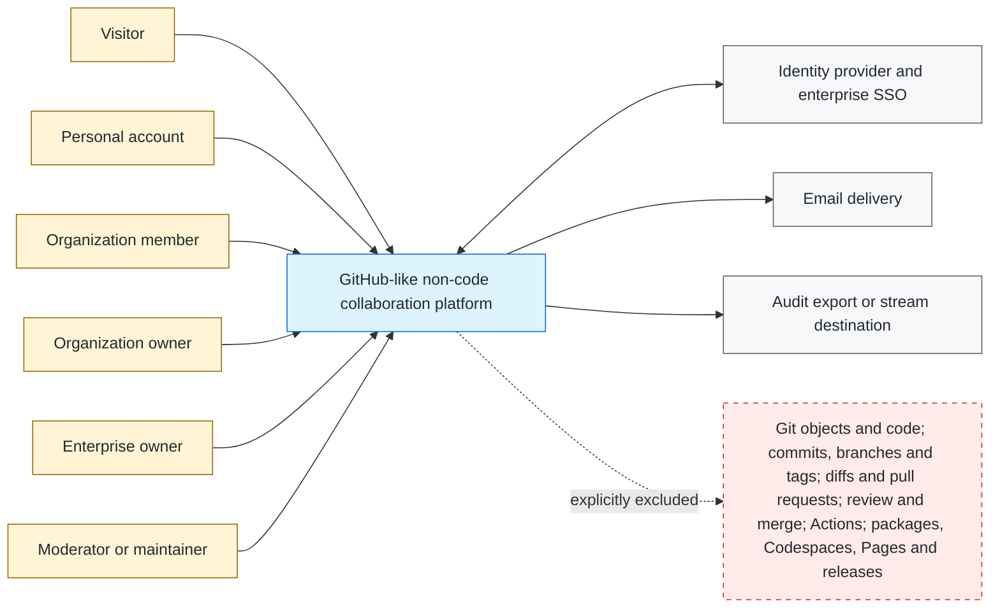
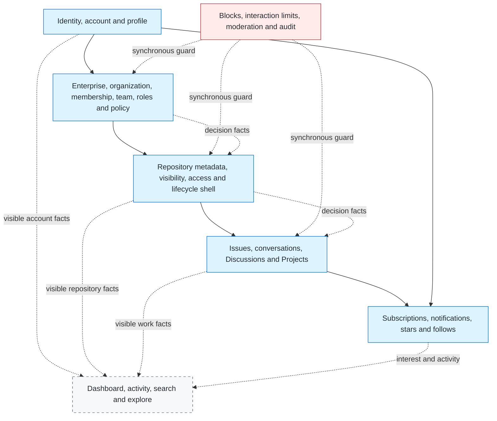

# System Context and Capability Landscape

The first view is a C4-style system context: it shows people, the modeled
product boundary, external systems, and explicit exclusions. It does not mix
internal capability ownership into the context boundary or claim GitHub's
private deployment topology.

Evidence: GH-AUTH-002, GH-ENTERPRISE-001, GH-ORG-001, GH-TEAM-001,
GH-REPO-001, GH-ISSUE-001, GH-DISCUSSION-001, GH-PROJECT-001,
GH-PROJECT-005, GH-NOTIFICATION-001, GH-SEARCH-001, GH-MODERATION-001,
GH-MODERATION-003 through GH-MODERATION-005, and GH-AUDIT-001.

The second view is the internal product capability landscape. The boxes are
semantic responsibilities, not deployable services or the canonical Support
bounded-context catalog. Exact context ownership and status are mapped in
[`09-capability-context-map.md`](09-capability-context-map.md).

## Derived boundary decisions

- A personal account remains distinct from every enterprise, organization,
  team, repository, and project role.
- The repository is retained as a metadata and collaboration owner even though
  its Git objects and code surfaces are excluded.
- Authorization is composed by each use case from resource-owned decision
  facts and ports. It is not a central business owner, and product events remain
  owned by the context that commits the fact.
- Personal/organization blocks and repository interaction limits are
  cross-capability safety guards. They are neither identity roles nor ordinary
  repository grants.
- Search indexes only retained resource types, rechecks authoritative
  visibility on reads, and never becomes an authorization source.
- Web is the modeled delivery surface. GitHub CLI, Mobile, GraphQL, and REST
  observations may support a source claim, but their transport contracts are
  deferred and must not be inferred from either diagram.
