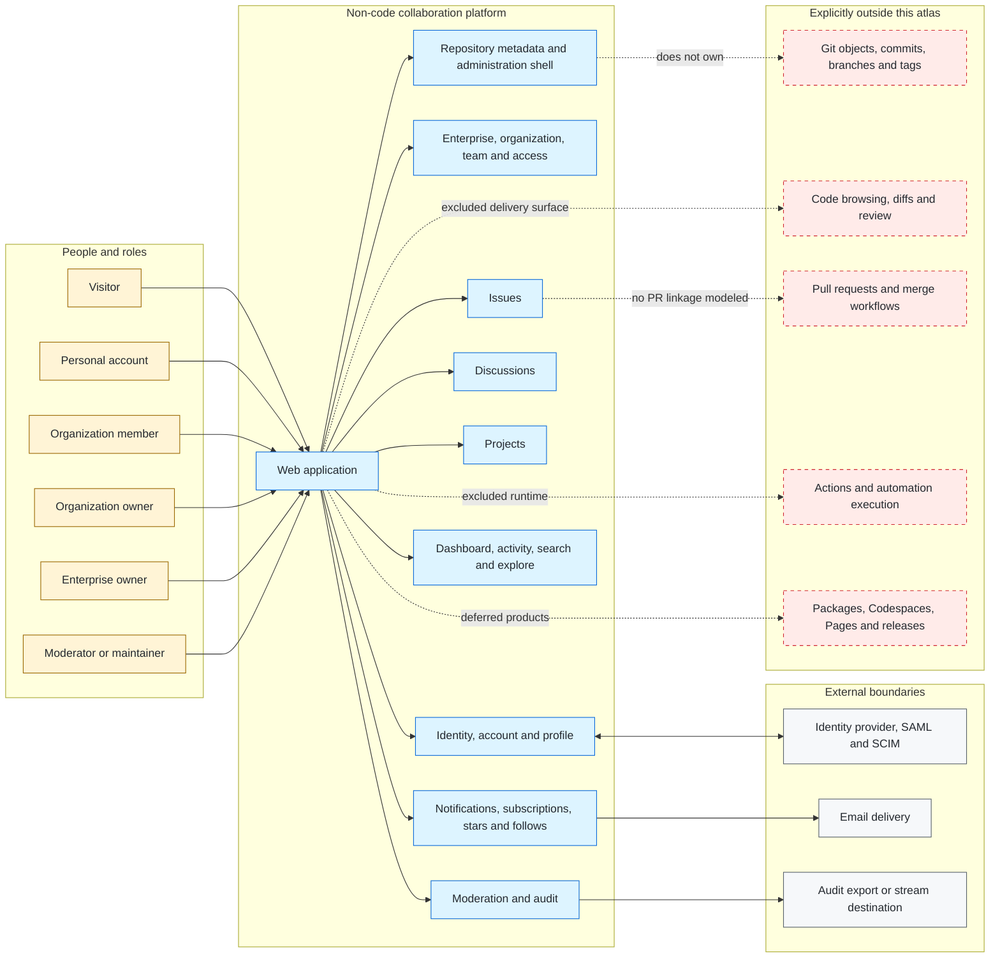

# System Context and Containers

This C4-style context view uses a Mermaid flowchart for stable rendering. It
defines product responsibilities, not GitHub's internal deployment topology.

Evidence: GH-AUTH-002, GH-ENTERPRISE-001, GH-ORG-001, GH-TEAM-001,
GH-REPO-001, GH-ISSUE-001, GH-DISCUSSION-001, GH-PROJECT-001,
GH-NOTIFICATION-001, GH-SEARCH-001, GH-MODERATION-001, and GH-AUDIT-001.

## Derived boundary decisions

- A personal account remains distinct from every enterprise, organization,
  team, repository, and project role.
- The repository is retained as a metadata and collaboration owner even though
  its Git objects and code surfaces are excluded.
- Authorization is a cross-cutting decision service; product events remain
  owned by the domain that caused them.
- Search indexes only retained resource types and must enforce the same
  visibility rules as direct navigation.
