# Lifecycle States

The grouped diagrams intentionally keep independent state dimensions separate.
For example, issue open/closed status does not determine whether its
conversation is locked, and notification read state does not determine whether
the item is saved or done.

Evidence: GH-AUTH-001, GH-ACCOUNT-001, GH-ORG-002, GH-ORG-003, GH-REPO-005,
GH-REPO-007, GH-REPO-008, GH-ISSUE-002, GH-COMMUNITY-001,
GH-DISCUSSION-002, GH-DISCUSSION-003, GH-PROJECT-003,
GH-PROJECT-004, GH-NOTIFICATION-001, GH-NOTIFICATION-002,
GH-MODERATION-003 through GH-MODERATION-005, and GH-ORG-004.

```mermaid
stateDiagram-v2
    state "Personal account" as Account {
        [*] --> CreatedUnverified
        CreatedUnverified --> Active: email verified
        Active --> Suspended: account-type-dependent suspension
        Suspended --> Active: reinstated
        Active --> Deleted: owner deletes account
        Deleted --> [*]
    }

    state "Organization invitation" as Invitation {
        [*] --> Pending
        Pending --> Accepted: invitee accepts
        Pending --> Cancelled: owner cancels
        Pending --> Expired: seven days elapse
        Expired --> Pending: owner retries
        Accepted --> [*]
        Cancelled --> [*]
    }

    state "Organization membership" as Membership {
        [*] --> ActiveMember
        ActiveMember --> FormerMember: removed or leaves
        FormerMember --> ActiveMember: owner reinstates
    }

    state "Outside collaborator relationship" as OutsideCollaborator {
        [*] --> PendingOutsideAccess
        PendingOutsideAccess --> ActiveOutsideAccess: invitation accepted
        PendingOutsideAccess --> CancelledOutsideAccess: invitation canceled
        ActiveOutsideAccess --> FormerOutsideAccess: access removed
        FormerOutsideAccess --> PendingOutsideAccess: owner invites with restore or fresh grants
    }

    state "Repository shell" as Repository {
        [*] --> ActiveRepository
        ActiveRepository --> ArchivedRepository: admin archives
        ArchivedRepository --> ActiveRepository: admin unarchives
        ActiveRepository --> DeletedRepository: authorized deletion
        DeletedRepository --> ActiveRepository: eligible restore within ninety days
        DeletedRepository --> PermanentlyRemoved: ineligible or restoration window ends
        PermanentlyRemoved --> [*]
    }

    state "Issue status" as IssueStatus {
        [*] --> OpenIssue
        OpenIssue --> ClosedCompleted: close as completed
        OpenIssue --> ClosedNotPlanned: close as not planned
        ClosedCompleted --> OpenIssue: reopen
        ClosedNotPlanned --> OpenIssue: reopen
    }

    state "Issue conversation" as IssueConversation {
        [*] --> IssueUnlocked
        IssueUnlocked --> IssueLocked: authorized lock
        IssueLocked --> IssueUnlocked: authorized unlock
    }

    state "Discussion status" as DiscussionStatus {
        [*] --> OpenDiscussion
        OpenDiscussion --> ClosedDiscussion: resolved irrelevant or duplicate
        OpenDiscussion --> DeletedDiscussion: maintainer deletes
        ClosedDiscussion --> DeletedDiscussion: maintainer deletes
        DeletedDiscussion --> [*]
    }

    state "Q and A answer" as AnswerState {
        [*] --> Unanswered
        Unanswered --> Answered: mark comment as answer
        Answered --> Unanswered: unmark answer
    }

    state "Discussion pin" as DiscussionPin {
        [*] --> Unpinned
        Unpinned --> Pinned: maintainer pins
        Pinned --> Unpinned: maintainer unpins
    }

    state "Discussion conversation" as DiscussionConversation {
        [*] --> DiscussionUnlocked
        DiscussionUnlocked --> DiscussionLocked: moderator locks
        DiscussionLocked --> DiscussionUnlocked: moderator unlocks
    }

    state "Project" as Project {
        [*] --> OpenProject
        OpenProject --> ClosedProject: close
        ClosedProject --> OpenProject: reopen
        OpenProject --> DeletedProject: permanently delete
        ClosedProject --> DeletedProject: permanently delete
        DeletedProject --> [*]
    }

    state "Project item" as ProjectItem {
        [*] --> ActiveProjectItem
        ActiveProjectItem --> ArchivedProjectItem: archive item
        ArchivedProjectItem --> ActiveProjectItem: restore item
        ActiveProjectItem --> DeletedProjectItem: delete item
        ArchivedProjectItem --> DeletedProjectItem: delete item
        DeletedProjectItem --> [*]
    }

    state "Notification read status" as NotificationRead {
        [*] --> Unread
        Unread --> Read: mark read
        Read --> Unread: mark unread
    }

    state "Notification triage" as NotificationTriage {
        [*] --> Inbox
        Inbox --> Saved: save
        Saved --> Inbox: unsave
        Inbox --> Done: mark done
        Saved --> Done: mark done
    }

    state "Subscription" as Subscription {
        [*] --> Subscribed
        Subscribed --> Unsubscribed: unsubscribe or unwatch
        Unsubscribed --> Subscribed: subscribe or watch
    }

    state "Personal block relationship" as PersonalBlock {
        [*] --> PersonallyUnblocked
        PersonallyUnblocked --> PersonallyBlocked: account owner blocks user
        PersonallyBlocked --> PersonallyUnblocked: account owner unblocks user
    }

    state "Organization block relationship" as OrganizationBlock {
        [*] --> OrganizationUnblocked
        OrganizationUnblocked --> TimedOrganizationBlock: owner or moderator sets duration
        OrganizationUnblocked --> IndefiniteOrganizationBlock: owner or moderator blocks indefinitely
        TimedOrganizationBlock --> OrganizationUnblocked: duration expires or manual unblock
        IndefiniteOrganizationBlock --> OrganizationUnblocked: manual unblock
    }

    state "Interaction limit" as InteractionLimit {
        [*] --> InteractionLimitInactive
        InteractionLimitInactive --> InteractionLimitActive: authorized actor selects cohort and duration
        InteractionLimitActive --> InteractionLimitInactive: duration expires or actor disables limit
    }
```

## Transition constraints

- `Suspended` is account-type and administrator dependent; it is not a normal
  self-service personal-account state.
- Repository restoration is eligibility constrained and does not restore team
  permissions.
- Archived repositories are read-only; retained content and permissions cannot
  be mutated until unarchived.
- Issue close reason and discussion answer are domain facts, not cosmetic UI
  labels.
- Project close/delete and project-item archive/delete are separate dimensions;
  archiving one item neither closes the project nor changes the source issue.
- `Saved` is not a read state. Implementations must not collapse
  `read_state` and `triage_state` into one enum.
- A personal or organization block can remove existing relationships when it
  is created. Unblocking does not imply that former follows, stars,
  assignments, invitations, subscriptions, or access grants are restored.
- Timed organization blocks and interaction limits require expiry processing.
  A higher-scope personal or organization interaction limit can prevent a
  repository-specific limit from being configured; precedence is an
  authorization guard, not another lifecycle state.
- Destructive terminal states require separate retention and audit decisions.
