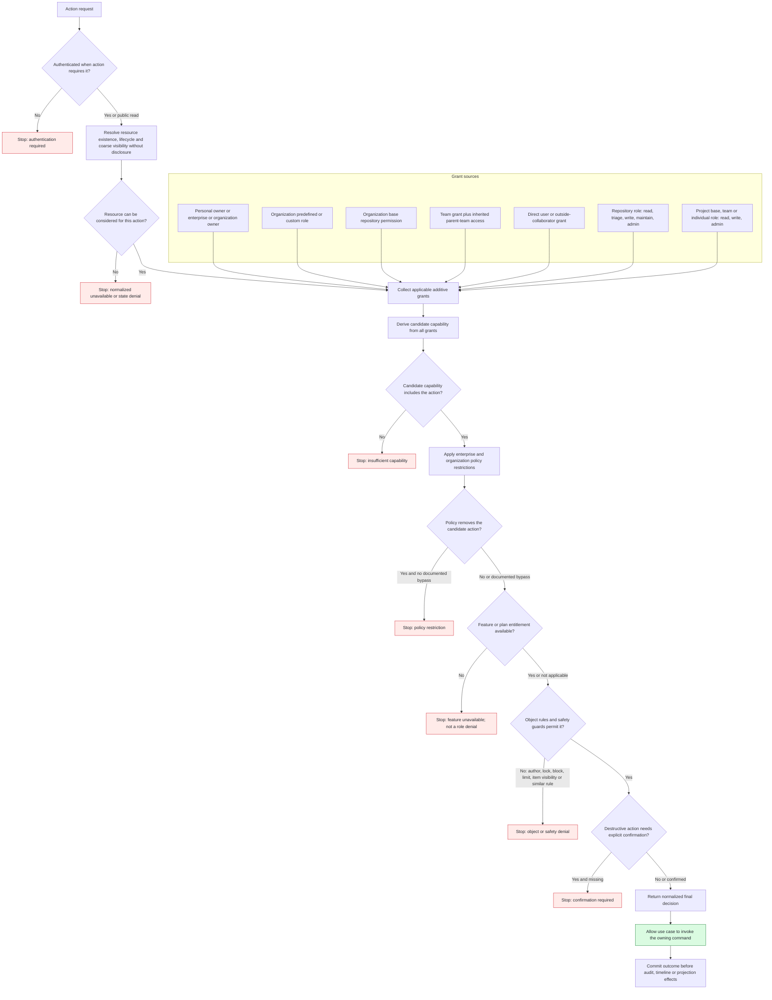

# Authorization Decision Model

This diagram is a derived authorization model. GitHub Docs confirms the role,
policy, grant, and object-level facts, but does not publish one universal
evaluation algorithm. The ordering below is the smallest deterministic target
model that preserves confirmed restrictions.

Evidence: GH-ENTERPRISE-001, GH-ENTERPRISE-002, GH-ORG-001, GH-TEAM-001,
GH-REPO-002, GH-REPO-003, GH-REPO-005, GH-REPO-007, GH-ISSUE-002,
GH-ISSUE-003, GH-ISSUE-005,
GH-COMMUNITY-001, GH-DISCUSSION-001, GH-DISCUSSION-003, GH-PROJECT-002,
GH-PROJECT-005, GH-MODERATION-002 through GH-MODERATION-005, and
GH-AUDIT-001.

Each application use case owns this composition and requests current decision
facts from the identity, membership, repository-access, policy, entitlement,
safety, and object-owning contexts. There is no central authorization domain
that copies those facts. Grants add candidate capability; policy only narrows
it; entitlement controls feature availability rather than actor authority; and
resource/object state determines whether an otherwise permitted action is
currently operable.

## Minimum permission matrix

| Action | Confirmed qualifying actor or grant | Additional guard |
| --- | --- | --- |
| Invite organization member | Organization owner | Invitation limit, license when applicable, target account/email, expiry, required 2FA. |
| Add/remove team member | Organization owner or team maintainer | Principal must be an organization member. |
| Manage repository access | Repository admin; organization owner has administrative access | Enterprise/organization policy can restrict access management. |
| Close own issue | Issue author | Issue and repository must allow the action. |
| Close another user's issue | Personal-repository owner/collaborator or organization-repository triage-plus | Preserve completed/not-planned reason. |
| Add/remove issue dependency or edit issue field | Repository triage-plus | Both issues and field definition must be applicable and visible; plan/organization constraints remain in force. |
| Manage discussion category | Write-plus for repository or source repository | Discussion feature and valid format/category constraints. |
| Moderate discussion | Triage-plus for repository or organization discussion source repository | Lock, answer, convert, and comment rules differ. |
| Change project visibility | Project admin or applicable organization owner | Item visibility remains constrained by its repository. |
| Manage project access | Project admin; organization owner is admin for organization projects | Organization base permission, team/individual grant eligibility, and item repository visibility remain independent. |
| Archive, transfer, or delete repository | Repository admin or applicable owner | Policy, target eligibility, typed confirmation, and lifecycle guard. |
| Block from personal account | Personal account owner | The relationship can remove follows, stars, assignments, subscriptions, invitations, and repository/project collaboration; unblock does not restore them. |
| Block from organization | Organization owner or moderator | Target must not remain an organization member; duration may be finite or indefinite. |
| Configure interaction limit | Repository admin or organization moderator for repository scope | Public repository, supported actor cohort and duration, plus higher-scope precedence. |
| Review organization audit log | Organization owner | Retention, query, export, and actor-visibility rules. |

Safety guards are evaluated independently from grants: having write/admin access
does not bypass a documented block or interaction limit. Creating a block can
also revoke relationships that contributed to discovery or access, so the
command must record its cascade before projections are treated as current.

No HTTP status, existence-disclosure payload, grant-conflict algorithm, or
entitlement catalog is asserted here. Final public error normalization remains
an API/delivery contract, and `commerce/entitlements` remains planned in the
canonical architecture catalog.
