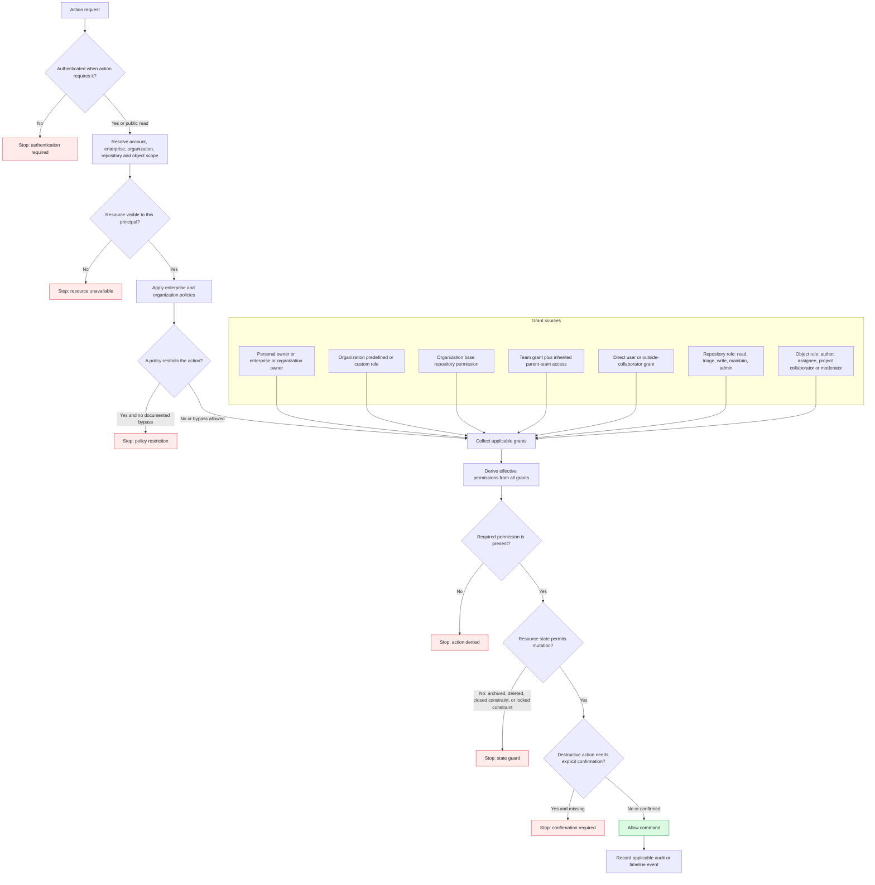

# Authorization Decision Model

This diagram is a derived authorization model. GitHub Docs confirms the role,
policy, grant, and object-level facts, but does not publish one universal
evaluation algorithm. The ordering below is the smallest deterministic target
model that preserves confirmed restrictions.

Evidence: GH-ENTERPRISE-001, GH-ENTERPRISE-002, GH-ORG-001, GH-TEAM-001,
GH-REPO-002, GH-REPO-003, GH-REPO-005, GH-REPO-007, GH-ISSUE-002,
GH-COMMUNITY-001, GH-DISCUSSION-001, GH-DISCUSSION-003, GH-PROJECT-002,
GH-MODERATION-002, and GH-AUDIT-001.

## Minimum permission matrix

| Action | Confirmed qualifying actor or grant | Additional guard |
| --- | --- | --- |
| Invite organization member | Organization owner | Invitation limit, license when applicable, target account/email, expiry, required 2FA. |
| Add/remove team member | Organization owner or team maintainer | Principal must be an organization member. |
| Manage repository access | Repository admin; organization owner has administrative access | Enterprise/organization policy can restrict access management. |
| Close own issue | Issue author | Issue and repository must allow the action. |
| Close another user's issue | Personal-repository owner/collaborator or organization-repository triage-plus | Preserve completed/not-planned reason. |
| Manage discussion category | Write-plus for repository or source repository | Discussion feature and valid format/category constraints. |
| Moderate discussion | Triage-plus for repository or organization discussion source repository | Lock, answer, convert, and comment rules differ. |
| Change project visibility | Project admin or applicable organization owner | Item visibility remains constrained by its repository. |
| Archive, transfer, or delete repository | Repository admin or applicable owner | Policy, target eligibility, typed confirmation, and lifecycle guard. |
| Review organization audit log | Organization owner | Retention, query, export, and actor-visibility rules. |

No HTTP status, existence-disclosure rule, or deny precedence beyond documented
policy restrictions is asserted here. Those are unresolved API-contract
decisions.
