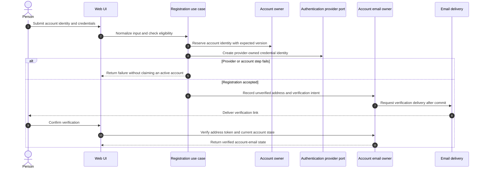
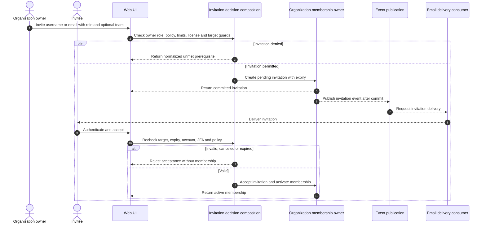
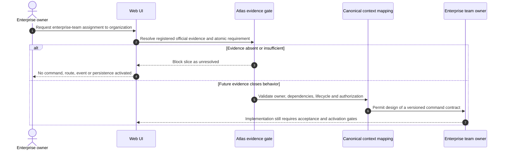
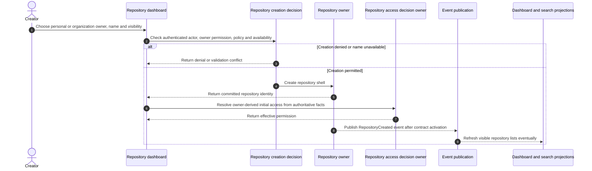
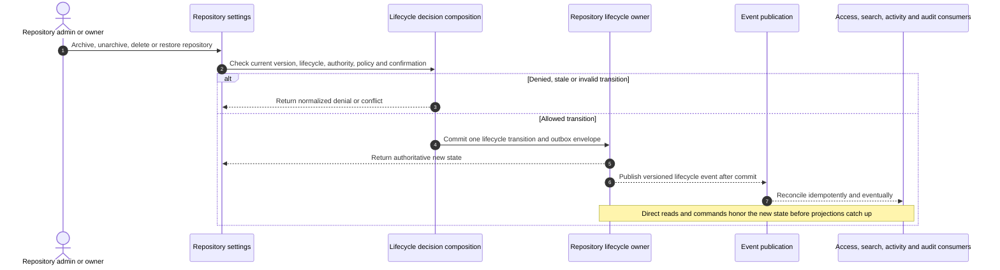
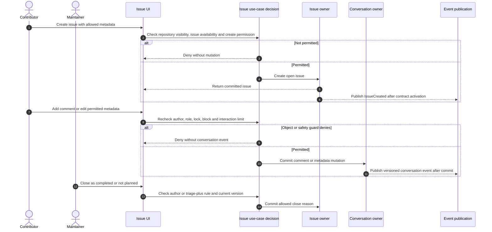
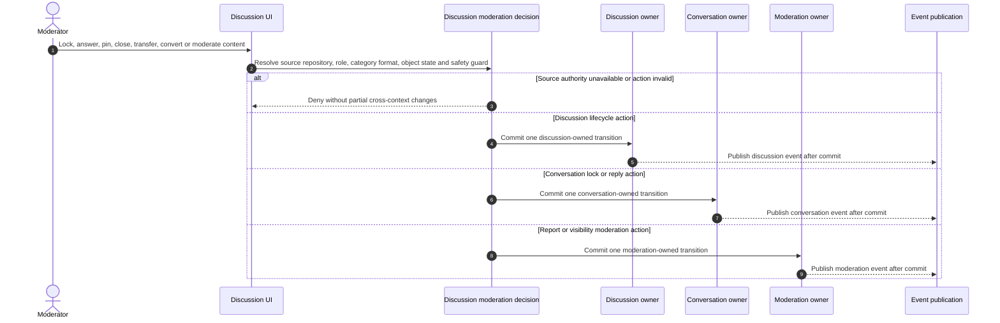
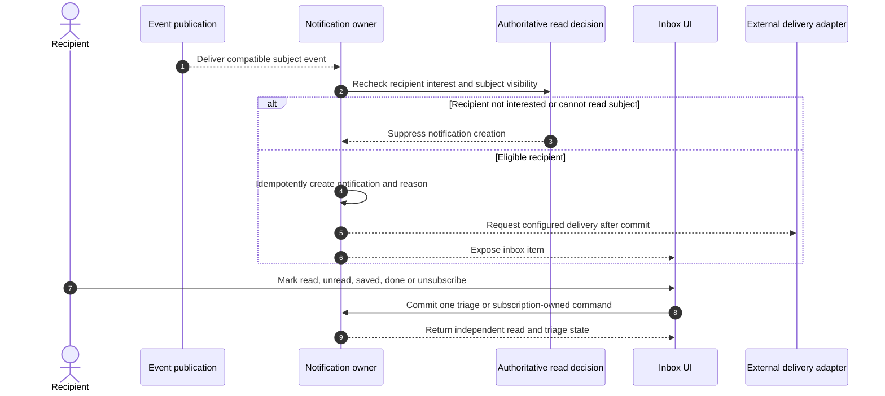
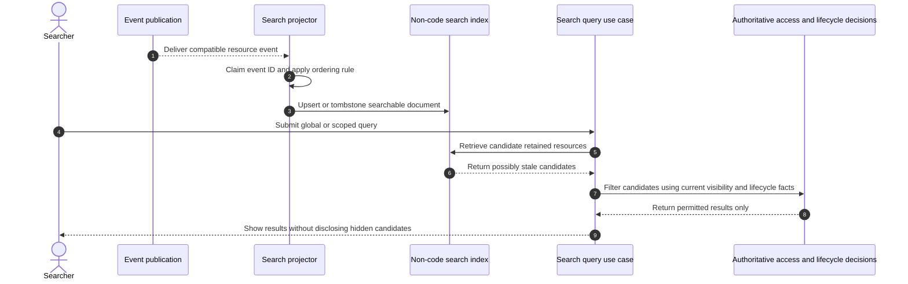
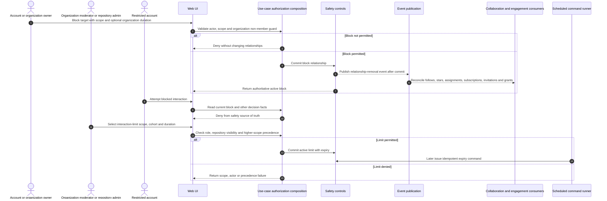

# Core Interaction Sequences

These sequences are target reconstruction flows, not claims about GitHub's
private services. Each diagram isolates one acceptance boundary so account,
membership, repository, collaboration, engagement, discovery, and safety
transactions are not mistaken for one distributed workflow.

Evidence: GH-AUTH-001, GH-AUTH-002, GH-ORG-002, GH-ORG-003, GH-TEAM-001,
GH-REPO-005, GH-REPO-007 through GH-REPO-010, GH-ISSUE-001,
GH-ISSUE-002, GH-COMMUNITY-001, GH-DISCUSSION-001 through
GH-DISCUSSION-003, GH-NOTIFICATION-001, GH-NOTIFICATION-002,
GH-SEARCH-001, GH-MODERATION-003 through GH-MODERATION-005, and
GH-AUDIT-001.

## Account registration and activation

The exact coordinator compensation and provider-recovery behavior are
implementation contracts. The diagram does not turn several owners into one
shared database transaction.

## Organization invitation and acceptance

## Enterprise-team organization assignment evidence gate

The canonical Support catalog has an enterprise-team organization-grant owner,
but the current Atlas source register does not yet close this GitHub product
behavior. This sequence deliberately stops before implementation; architecture
metadata is not product evidence.

## Repository creation and initial access

## Repository lifecycle

## Issue and conversation mutation

## Discussion moderation

Conversion between a Discussion and an Issue needs an explicit orchestration
and compensation contract because the two product facts have different owners;
this diagram does not imply a distributed transaction.

## Notification generation and inbox triage

## Search indexing and permission-safe lookup

## Blocking and interaction limits

Blocking and interaction limits cross domain boundaries. The safety source of
truth must deny new interactions immediately; relationship cleanup can follow
the committed event without reopening an authorization window.

## Required failure coverage

- duplicate, expired, canceled, flagged-account, unverified-email, required-2FA,
  plan-license, and rate-limit invitation cases;
- provider failure and partial account-registration coordination without an
  incorrectly reported active account;
- repository name conflict, owner ineligibility, policy denial, stale version,
  archive/read-only guard, delete confirmation, restore ineligibility, and
  projection lag;
- policy-denied, role-denied, archived-repository, locked-conversation, block,
  and interaction-limit issue mutations;
- invalid Discussion source authority, category format, answer eligibility,
  lock/delete/transfer/convert failure, and cross-owner compensation;
- notification participation, mention, watch, custom watch, ignore,
  unsubscribe, done, saved, retention, duplicate event, and hidden-subject
  cases;
- stale search documents, deleted tombstones, hidden candidates, duplicate or
  out-of-order events, replay, and projector rebuild;
- invalid block scope, organization-member target, unauthorized moderator,
  finite/indefinite unblock, higher-scope interaction-limit precedence, cohort
  mismatch, expiry, and idempotent relationship-cascade cases;
- audit/timeline side effects only after the associated command outcome is
  committed and known.
