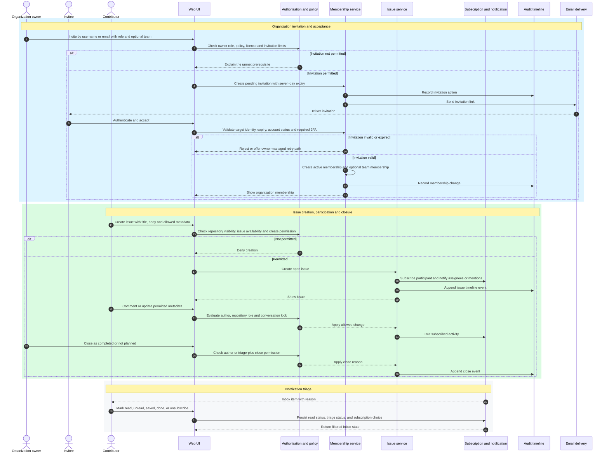

# Core Interaction Sequences

These sequences are target reconstruction flows, not claims about GitHub's
private services. They preserve observable actors, prerequisites, results, and
side effects from the official documentation.

Evidence: GH-ORG-002, GH-ORG-003, GH-ISSUE-001, GH-ISSUE-002,
GH-COMMUNITY-001, GH-NOTIFICATION-001, GH-NOTIFICATION-002, and GH-AUDIT-001.

## Required failure coverage

- duplicate, expired, canceled, flagged-account, unverified-email, required-2FA,
  plan-license, and rate-limit invitation cases;
- policy-denied, role-denied, archived-repository, and locked-conversation issue
  mutations;
- notification participation, mention, watch, custom watch, ignore,
  unsubscribe, done, saved, and retention cases;
- audit/timeline side effects only after the associated command outcome is
  known.
