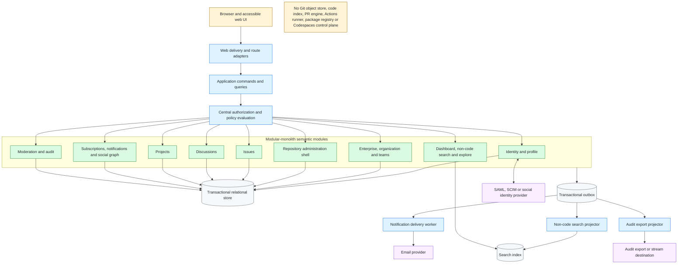

# Reconstruction Architecture

This is a target architecture inferred for faithful, low-ambiguity
implementation. It is not evidence of GitHub's internal topology. A modular
monolith keeps semantic transactions and authorization decisions inspectable;
asynchronous projections isolate delivery, search, and audit export.

Evidence for product boundaries: GH-AUTH-002, GH-ENTERPRISE-002, GH-ORG-001,
GH-REPO-001, GH-ISSUE-001, GH-DISCUSSION-001, GH-PROJECT-001,
GH-NOTIFICATION-001, GH-SEARCH-001, and GH-AUDIT-001.

## Architecture decisions requiring implementation contracts

- Commands own transactions; search, notification delivery, and external audit
  export consume committed events.
- The transactional outbox is a reconstruction reliability choice, not a
  GitHub-documented fact.
- Authorization must be callable consistently from routes, commands, search,
  notification projection, and navigation visibility.
- The search index contains only retained non-code resources and never becomes
  the authority for access or lifecycle state.
- Audit facts are append-only observations; moderation state and operational
  delivery state remain owned by their product modules.
- External identity and email providers are ports. No provider-specific rule is
  part of the domain unless official product semantics require it.
