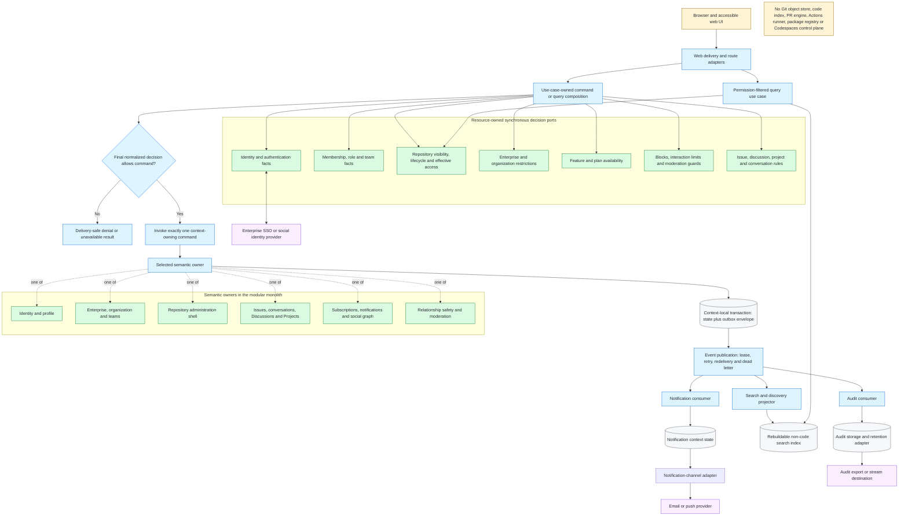

# Reconstruction Architecture

This is a target architecture inferred for faithful, low-ambiguity
implementation. It is not evidence of GitHub's internal topology. A modular
monolith keeps context-local mutations and use-case decisions inspectable;
asynchronous publication and rebuildable projections isolate delivery, search,
notifications, and audit export.

Evidence for product boundaries: GH-AUTH-002, GH-ENTERPRISE-002, GH-ORG-001,
GH-REPO-001, GH-ISSUE-001, GH-DISCUSSION-001, GH-PROJECT-001,
GH-PROJECT-005, GH-NOTIFICATION-001, GH-SEARCH-001,
GH-MODERATION-003 through GH-MODERATION-005, and GH-AUDIT-001.

| Semantic owner | Owns | Must not own |
| --- | --- | --- |
| Identity and profile | Personal account, authentication boundary, email and profile facts | Organization/repository/project roles |
| Governance | Enterprise/organization membership, invitations, teams, scoped roles and policy | Repository or collaboration object state |
| Repository | Owner shell, visibility, access grants, rename and lifecycle | Git objects or code surfaces |
| Issues and conversations | Issue lifecycle, relations, assignment, comments, reactions and locks | Project-specific field definitions or values |
| Discussions | Categories, discussions, answers, pins and discussion lifecycle | Organization membership or source-repository access |
| Projects | Project grants, items, fields, views, workflows and project/item lifecycle | Visibility of referenced repository content |
| Engagement | Subscriptions, notifications, stars and follows | Authoritative subject visibility |
| Projections | Dashboard, activity, discovery and search read models | Authorization or lifecycle authority |
| Safety and audit | Blocks, interaction limits, reports, moderation facts and retained audit observations | Source-domain content or delivery telemetry |

Authorization composes current facts from these owners. No context may copy a
role, block, visibility, entitlement, or lifecycle value and then treat the
copy as an independent authority. The exact catalog mapping is validated in
[`09-capability-context-map.md`](09-capability-context-map.md).

## Architecture decisions requiring implementation contracts

- One command commits one context-local version-checked transition and its
  event envelope in the same context-owned outbox. Cross-context distributed
  transactions are not the default.
- Publication failure after commit does not roll back the command. Consumers
  must tolerate delay and duplicate redelivery and must persist an idempotency
  receipt with their local side effect.
- Use cases own authorization composition. Resource contexts expose decision
  ports; there is no central authorization service that owns or copies all
  product facts.
- Blocks and interaction limits are synchronous authorization inputs. Their
  cross-domain cleanup is event-driven, but projection lag must never permit an
  interaction that the committed safety source of truth denies.
- Project permission and project visibility do not replace repository
  visibility for referenced items; both decisions must pass.
- Search, dashboard, activity, and discovery projections are rebuildable and
  eventually consistent. A projection never becomes the authority for access
  or lifecycle state.
- Audit facts are append-only observations; moderation state and operational
  delivery state remain owned by their product contexts.
- External identity, delivery, index, and audit providers are ports. No
  provider-specific rule enters the domain without a verified product need.
