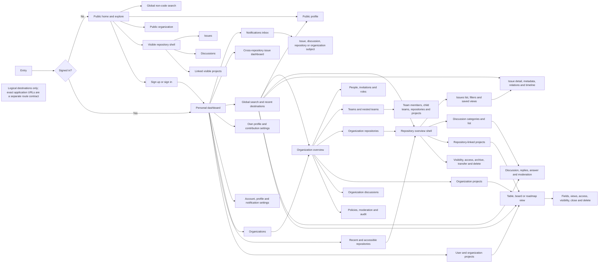

# Logical Navigation

This diagram defines reachable destinations and navigation responsibilities.
Labels are logical screens, not literal GitHub or Support URLs. A separate route
contract must assign concrete paths without changing these product semantics.

Evidence: GH-DASH-001, GH-PROFILE-001, GH-ORG-001, GH-TEAM-001,
GH-REPO-003, GH-ISSUE-001, GH-DISCUSSION-001, GH-PROJECT-001,
GH-PROJECT-002, GH-NOTIFICATION-002, and GH-SEARCH-001.

## Navigation invariants

- Public navigation exposes only resources visible to the visitor.
- Authentication returns the user to a valid destination or the personal
  dashboard; it never creates product authorization by itself.
- Menus and direct navigation use the same authorization decision.
- Search results and notification deep links re-evaluate current visibility and
  state.
- Project visibility does not reveal inaccessible private-repository items.
- Administrative destinations appear only for actors with the corresponding
  scoped permission.
