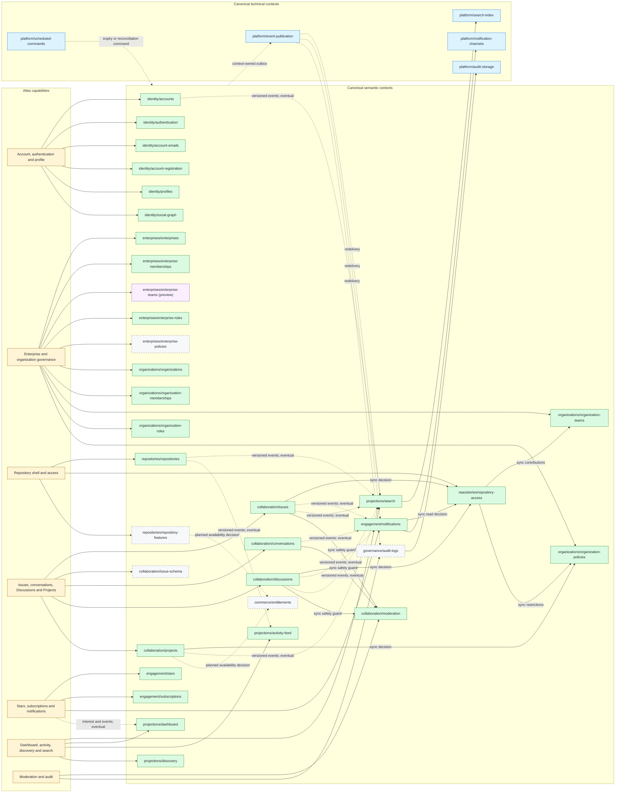

# Capability-to-Context Map

This is a derived, implementation-facing view of the atlas. Product semantics
still come from [`source-register.md`](source-register.md); context identity,
ownership, relationships, event contracts, and implementation status remain
authoritative only in
[`../architecture/module-map.json`](../architecture/module-map.json). This
file must be regenerated or revalidated when that catalog changes and must
never become a second hand-maintained catalog.

The status classes below were validated against catalog version 6 on
2026-08-02. An active context can still contain planned event contracts or
planned relationships; context status must not be used as a shortcut for
contract readiness.

## Ownership and readiness cross-check

| Atlas slice | Canonical owner set | Synchronous dependencies that remain authoritative | Eventual consumers | Material readiness gap |
| --- | --- | --- | --- | --- |
| Accounts and profiles | `identity/accounts`, `authentication`, `account-emails`, `account-registration`, `profiles` | Current account, session, email and profile decisions | Search, dashboard and activity projections | Provider-specific recovery and enrollment remain delivery contracts. |
| Enterprise and organization governance | Enterprise and organization membership, team, role and policy contexts | Principal affiliation, roles, team contribution and policy restriction | Audit and downstream discovery effects | `enterprise-policies` is planned; enterprise teams are active but preview. |
| Repository shell and access | `repositories/repositories`, `repository-access` | Lifecycle, visibility, effective permission and policy inputs | Search, activity, notification and audit consumers | `repository-features` and several lifecycle event contracts remain planned. |
| Issues and conversations | `collaboration/issues`, `conversations` | Repository read/mutation decision and object rules | Notifications, search, activity and audit | `issue-schema` and issue event contracts remain planned. |
| Discussions and Projects | `collaboration/discussions`, `projects` | Source-repository/project grants, organization policy and item visibility | Notifications, search, activity and audit | Source-repository disruption semantics and several event contracts remain unresolved or planned. |
| Engagement | `engagement/stars`, `subscriptions`, `notifications` | Subject visibility and recipient/interest decisions | Dashboard, discovery and external delivery | Delivery is a technical adapter; notification event contracts remain planned. |
| Moderation and audit | `collaboration/moderation`; planned `governance/audit-logs` | Active block/limit and resource moderation decisions | Relationship cleanup and audit export | Audit product context and retention contract remain planned. |
| Discovery | Projection contexts plus technical search index | Direct reads must recheck authoritative access and lifecycle | Index and read-model refresh | Freshness is observable; projection data can never authorize. |

Solid dependency labels mean a current decision read is required. Dashed
eventual edges mean a committed, versioned event may update a consumer later.
Neither edge activates a planned context, event, relationship, route, schema,
or acceptance contract.

## Mapping gaps

- Enterprise-team organization assignment exists in the canonical catalog, but
  the Atlas source register does not yet contain sufficient official evidence
  for a confirmed product sequence. It remains a mapping checkpoint in
  [`06-core-sequences.md`](06-core-sequences.md).
- Repository feature enablement, issue schema, entitlements, and audit logs
  have catalog owners but are not all active implementation contracts.
- Organization Discussion behavior after its source repository is archived,
  transferred, deleted, or otherwise unavailable remains unresolved.
- The exact catalog status must always be read from `module-map.json`; this
  dated view is explanatory and becomes stale when the catalog version changes.
