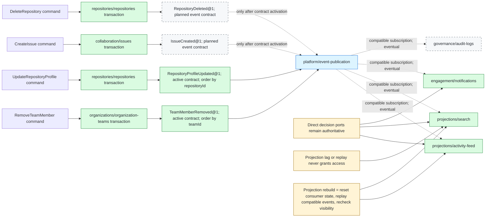

# Command, Event, and Projection Map

This architecture map turns a permitted interaction into one durable product
fact and makes downstream lag explicit. It is a reconstruction contract, not a
claim about GitHub internals. Canonical context relationships and event
contract status remain owned by
[`../architecture/module-map.json`](../architecture/module-map.json) and the
accepted architecture decisions.

```mermaid
sequenceDiagram
    autonumber
    actor Actor
    participant Delivery as Web delivery
    participant UseCase as Use-case decision composition
    participant Owner as Owning context
    participant Store as Context store and outbox
    participant Publisher as Event publication
    participant Consumer as Event consumer
    participant Projection as Consumer state or projection

    Actor->>Delivery: Request action with expected version and confirmation
    Delivery->>UseCase: Normalize actor, resource and input
    UseCase->>UseCase: Resolve lifecycle, grants, policy, entitlement and object guards
    alt Decision denies or resource version is stale
        UseCase-->>Delivery: Normalized denial, conflict or unavailable result
        Delivery-->>Actor: No product mutation and no success event
    else Decision allows command
        UseCase->>Owner: Invoke one context-owning command
        Owner->>Store: Atomically persist version-checked mutation and event envelope
        Store-->>Owner: Commit succeeds
        Owner-->>Delivery: Return committed command result
        Delivery-->>Actor: Success does not wait for projections
        Publisher->>Store: Lease committed outbox envelope
        Publisher->>Consumer: Deliver VersionedEvent@1 with eventId and ordering key
        Consumer->>Consumer: Reject incompatible version or claim idempotency receipt
        alt Duplicate delivery
            Consumer-->>Publisher: Acknowledge already-applied event
        else First valid delivery
            Consumer->>Projection: Atomically persist side effect and receipt
            Consumer-->>Publisher: Acknowledge event
        end
        opt Transient consumer failure
            Publisher->>Publisher: Retry with bounded backoff
        end
        opt Retry policy exhausted
            Publisher->>Publisher: Dead-letter for reconciliation
        end
    end
```

The generic event name above is intentional: every concrete event requires a
registered name, version, payload contract, producer ordering key, compatible
consumer, and replay test before activation.



## Concrete contract checkpoint

| Command example | Atomic owner and mutation | Published event | Ordering and idempotency | Mapped downstream behavior | Current boundary |
| --- | --- | --- | --- | --- | --- |
| Remove team member | `organizations/organization-teams` changes team membership | `TeamMemberRemoved@1` | Active contract ordered by `teamId`; consumer receipt keyed by event ID | Authorization reads current membership/team facts; audit or cleanup consumers may react later | Active event does not prove every consumer relationship or cascade is active. |
| Update repository profile | `repositories/repositories` changes repository profile | `RepositoryProfileUpdated@1` | Active contract ordered by `repositoryId` | Activity projection may refresh after commit | Search inclusion is not inferred from this event unless the catalog declares it. |
| Create issue | `collaboration/issues` creates the issue | `IssueCreated@1` | Contract, ordering key, payload and replay acceptance remain planned | Notification, search and activity relationships are cataloged as eventual | Do not publish a hand-shaped event before the canonical contract activates. |
| Delete repository | `repositories/repositories` commits lifecycle/tombstone facts | `RepositoryDeleted@1` | Contract and compatible consumer receipts remain planned | Repository access, search, activity and audit can reconcile after commit | Direct reads and commands must honor the authoritative deleted state immediately. |

## Consistency invariants

- One command mutates one owning context by default; there is no distributed
  product transaction across contexts.
- The product mutation and its outbox envelope either commit together or do
  not commit. Publication, delivery, retry, and dead-letter handling occur
  after that commit.
- The producer supplies a stable event ID, aggregate ordering key, schema
  version, occurrence time, and payload contract. A consumer persists its local
  side effect and idempotency receipt in one local transaction.
- Eventual consumers tolerate duplicates, delay, stale references, and replay.
  They do not silently invent missing source facts.
- A projection declares how to reset, replay compatible events, reconcile
  tombstones, and reapply current visibility. Rebuild success is part of its
  acceptance contract.
- Notifications, search, activity, and audit are separate consumers. Failure
  in one does not roll back an already committed product command or imply that
  the others succeeded.
