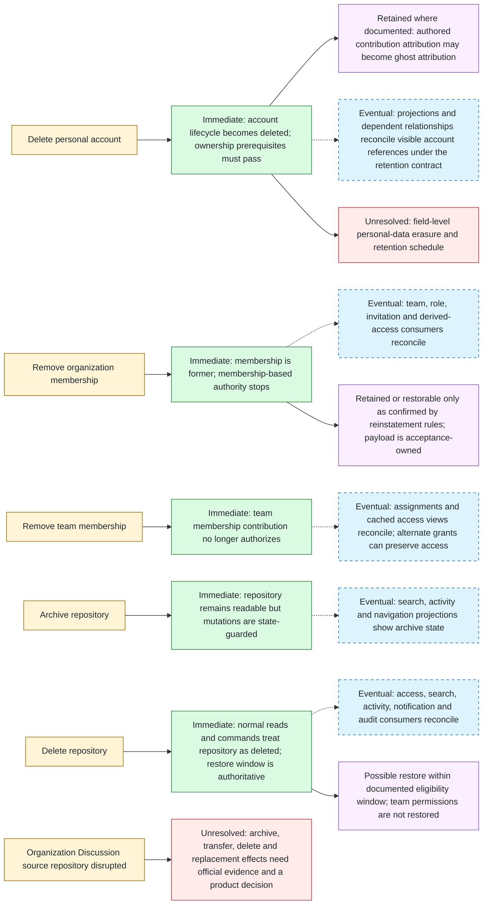

# Lifecycle Impact and Retention

Local state diagrams do not by themselves explain what a destructive or
access-changing transition does to other resources. This view separates the
authoritative synchronous effect from event-driven cleanup, projection refresh,
retained attribution, restoration, and unresolved retention choices.

Evidence: GH-ACCOUNT-001, GH-ORG-003, GH-TEAM-002, GH-REPO-005,
GH-REPO-007, GH-REPO-008, GH-DISCUSSION-001, GH-NOTIFICATION-002,
GH-MODERATION-003, GH-MODERATION-004, and GH-AUDIT-001.

Dashed edges are eventual effects and must be idempotent. They do not delay the
authoritative denial: a removed membership, removed team contribution, active
archive, or deleted repository must be enforced from current source facts even
while projections still show stale entries.

## Impact and retention matrix

| Trigger | Same-context authoritative effect | Cross-context or projection effect | Retained facts | Erased or anonymized | Reversible | Confidence and implementation decision |
| --- | --- | --- | --- | --- | --- | --- |
| Personal account deletion | Account lifecycle and ghost-attribution decision commit in the account owner context after documented prerequisites | Social, engagement, search, dashboard, activity and audit consumers reconcile later | Authored contributions may retain ghost attribution where documented | Field-level identity erasure is not defined by this atlas | Account deletion is modeled terminal; content ownership must be handled first | Confirmed lifecycle effect; privacy retention schedule is **Unresolved**. |
| Organization membership removal | Membership becomes former and can no longer contribute current organization authority | Team membership, role assignment, access views, notifications and audit may reconcile | Reinstatement-related facts only to the extent official behavior requires them | No blanket content deletion is inferred | Reinstatement exists, but the exact restored grant payload needs acceptance rules | Confirmed removal/reinstatement capability; cross-context payload is **Derived/Unresolved**. |
| Team membership removal | Team membership contribution stops; effective access is recalculated from remaining sources | Assignment and projection cleanup may occur after commit | Direct, base, inherited, or other valid grants can preserve repository access | No authored content erasure is inferred | Re-adding membership is a new authorized action, not rollback magic | Confirmed access/assignment effects; reconciliation mechanics are **Derived**. |
| Repository archive | Lifecycle becomes archived and mutation guards apply | Search, activity, navigation and notification presentation refresh | Repository metadata and collaboration content remain readable; documented star behavior remains separate | Nothing is erased by archive | Authorized unarchive restores operability | Confirmed. |
| Repository deletion | Deleted/tombstone and restoration-window facts become authoritative; normal navigation stops | Access, search, activity, notifications and audit reconcile from the committed event | Only restoration and audit facts required by the documented window and implementation policy | Physical purge schedule and backup retention are not defined here | Eligible owner restore within ninety days; team permissions are not restored | Confirmed product behavior; physical retention is **Unresolved**. |
| Organization Discussion source repository archive, transfer, deletion, or replacement | No transition is selected by current Atlas evidence | No cleanup or migration event may be invented | Unknown | Unknown | Unknown | **Unresolved** and implementation-blocking until evidence and ownership are explicit. |

## Required implementation decisions

- Define a context-owned tombstone/restore contract separately from physical
  deletion, backup expiry, legal hold, analytics retention, and audit retention.
- Name every cascade consumer, its idempotency key, ordering key, retry/dead
  letter policy, stale-reference behavior, and reconciliation command.
- Ensure direct authorization and lookup paths read current lifecycle and
  membership authorities instead of trusting lagging search or dashboard data.
- Specify restoration as a new versioned transition. It restores only the facts
  explicitly promised by evidence; it does not replay every former grant or
  relationship.
- Keep the organization Discussion source-repository disruption slice blocked
  until official evidence, desired product behavior, context ownership, events,
  retention, and acceptance cases agree.
