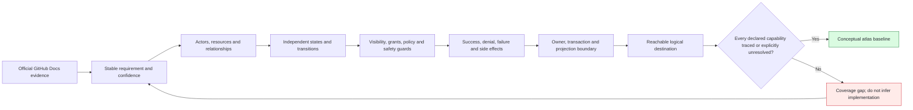

# GitHub Non-Code Product Semantics Atlas

## Purpose

Audience: product architects, domain modelers, and Codex agents preparing a
GitHub-like collaboration platform without Git or code-development workflows.

This atlas derives a reconstruction model from current GitHub documentation.
Its product-semantic authority is the official source register in
[`source-register.md`](source-register.md). It does not claim to describe
GitHub's private implementation, and it does not change this repository's
canonical architecture or activate any runtime module.

## Scope boundary

The atlas includes:

- personal accounts, authentication boundaries, profiles, and dashboards;
- enterprises, organizations, memberships, invitations, roles, and teams;
- repository ownership, metadata, visibility, access, policy, and lifecycle;
- Issues, Discussions, Projects, notifications, subscriptions, stars, follows,
  activity, non-code search, moderation, and audit;
- the interactions among those capabilities.

The task boundary excludes Git objects, repository file contents, commits,
branches, tags, diffs, pull requests, review and merge workflows, Actions,
packages, Codespaces, Pages, and releases. Where official documentation says an
excluded capability affects retained metadata, the atlas records only that
observable effect.

Authentication providers, email delivery, search indexing, and audit export are
system boundaries. Detailed billing, application integration, sponsorship,
security-product, and Wiki behavior is not modeled in this first atlas.

## Completeness contract

"Complete" has three different meanings here. They must not be collapsed:

| Question | Verdict | Boundary |
| --- | --- | --- |
| Does the atlas cover every GitHub capability that is neither Git nor code? | **No** | Billing, Apps and integrations, sponsorship, security products, Wikis, API/CLI/Mobile delivery variants, and deployment-specific administration remain deferred. |
| Is the declared core collaboration slice semantically closed? | **Yes, at conceptual-atlas level** | Each included capability must reach evidence, a requirement, concepts, independent states, authorization, an interaction or explicit non-interaction rationale, architecture ownership, and logical navigation. Open variants remain labeled **Unresolved**. |
| Is the slice ready to implement without further design? | **No** | Physical schema, command/query contracts, literal routes, errors, retention, deployment and plan choices, migrations, and acceptance tests remain owned by implementation contracts. |

The closure test is a traceability gate, not a feature-count claim:

The capability-level result and remaining implementation gaps are maintained in
[`01-requirements-traceability.md`](01-requirements-traceability.md). A future
atlas expansion must add official evidence and repeat the full closure test; it
must not silently widen this boundary.

## First-principles method

Every modeled behavior follows this chain:

1. Record an observable statement from `docs.github.com`.
2. Separate the stable invariant from plan-specific or preview behavior.
3. Derive actors, resources, relationships, states, permissions, and events.
4. Represent the derivation in the smallest suitable Mermaid diagram.
5. Mark target-architecture choices as inference rather than GitHub fact.
6. Trace implementation work back to a requirement and official source ID.

The confidence vocabulary is:

- **Confirmed**: directly stated by a registered GitHub Docs source.
- **Derived**: the smallest model that satisfies several confirmed statements.
- **Unresolved**: documentation is silent, preview-only, plan-dependent, or
  insufficient to select one implementation.

Existing Support source, architecture documents, and memories were not used as
evidence for GitHub product semantics. They were consulted only for repository
placement and documentation workflow.

## Feature-slice development flow

The atlas becomes implementation input only through this trace. Skipping a
node leaves the slice blocked even when a neighboring diagram looks complete.

```mermaid
flowchart LR
    Source["Registered official evidence"] --> Requirement["Atomic requirement and confidence"]
    Requirement --> Ownership["Concept and bounded-context ownership"]
    Ownership --> Model["Relationships and independent lifecycle states"]
    Model --> Authorization["Decision inputs and denied cases"]
    Authorization --> UseCase["Use-case command or query contract"]
    UseCase --> Consistency["Atomic boundary, event and failure semantics"]
    Consistency --> Data["Context-owned data and migration contract"]
    Data --> Adapter["Persistence and external adapters"]
    Adapter --> Delivery["Web delivery and logical navigation"]
    Consistency --> Projection["Idempotent rebuildable projections"]
    Delivery --> Acceptance["Acceptance and architecture checks"]
    Projection --> Acceptance
    Acceptance --> Activation{"Catalog activation criteria satisfied?"}
    Activation -- "Yes" --> Active["Activate the bounded slice"]
    Activation -- "No" --> Blocked["Keep planned or record the mapping gap"]
    Blocked --> Requirement

    classDef pass fill:#dafbe1,stroke:#1a7f37,color:#24292f
    classDef gap fill:#ffebe9,stroke:#cf222e,color:#24292f
    class Active pass
    class Blocked gap
```

The invariants are: one product fact has one semantic owner; one command
commits one context-local transaction by default; the mutation and its outbox
record commit together; projections are eventually consistent and never
authorize; and catalog activation remains governed by the canonical
architecture workflow rather than by this atlas.

## Diagram chain

| Order | Diagram | Responsibility |
| --- | --- | --- |
| 1 | [Requirements traceability](01-requirements-traceability.md) | Defines the reconstruction obligations and their model owners. |
| 2 | [System context and containers](02-system-context.md) | Fixes actors, product boundary, external systems, and exclusions. |
| 3 | [Conceptual domain ERD](03-domain-erd.md) | Defines product concepts and relationship ownership. |
| 4 | [Lifecycle states](04-lifecycle-states.md) | Defines independently verifiable state transitions. |
| 5 | [Authorization decisions](05-authorization.md) | Defines how policy, roles, grants, object rules, and state guards combine. |
| 6 | [Core interaction sequences](06-core-sequences.md) | Defines representative end-to-end success and failure paths. |
| 7 | [Reconstruction architecture](07-reconstruction-architecture.md) | Maps semantics into a target implementation without claiming GitHub internals. |
| 8 | [Logical navigation](08-logical-navigation.md) | Defines reachable product destinations without fixing literal URLs. |
| 9 | [Capability-to-context map](09-capability-context-map.md) | Validates semantic ownership and dependency modes against the canonical context catalog. |
| 10 | [Command, event, and projection map](10-command-event-projection-map.md) | Defines the consistency, publication, idempotency, and rebuild contract. |
| 11 | [Lifecycle impact and retention](11-lifecycle-impact-retention.md) | Traces destructive or access-changing transitions across retained resources and projections. |

## How Codex should use this atlas

For a feature slice, Codex should start at the requirement ID, follow its
evidence IDs into the source register, select the relevant domain entities and
state transitions, then apply the authorization and sequence diagrams. The
architecture and navigation diagrams constrain placement and presentation only
after the product behavior is understood.

The diagrams are not a physical database schema, route contract, OpenAPI
contract, or complete acceptance suite. Before implementation, a slice still
needs:

- field-level data definitions and validation;
- command/query and error contracts;
- acceptance cases for every permitted and forbidden transition;
- plan and deployment assumptions;
- an explicit decision for every unresolved item.

## Verification

All Mermaid blocks changed by the latest completeness pass were rendered with
Mermaid Chart on 2026-08-02. Product
source links remain restricted to HTTPS pages under `docs.github.com`; sources
added for issue planning, outside collaborators, project access, blocking, and
interaction limits were reverified on that date. Repository verification must
additionally check source-ID closure, Markdown links, Mermaid syntax, the actual
diff, and `git diff --check`.
